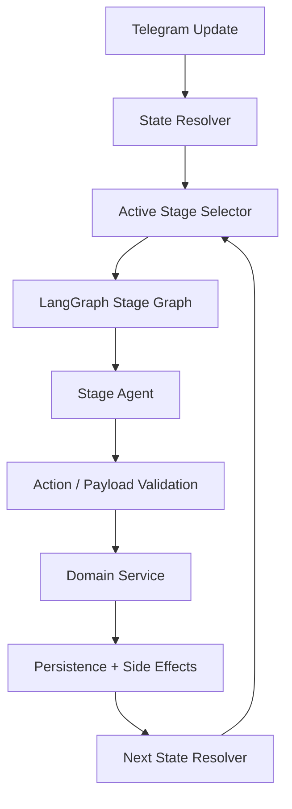

# HELLY v1 Agent-Owned Stage Architecture

LangGraph-Based Agent-per-Stage Product Architecture

Version: 1.0  
Date: 2026-03-07

## 1. Purpose

This document defines the new canonical runtime model for Helly v1.

It replaces the previous target of:

- deterministic Telegram routing
- plus one shared state-aware controller
- plus optional in-state AI help

with a stronger target:

- every major user-facing workflow stage is represented as a persisted state
- every user-facing state is executed by its own bounded AI stage agent
- `LangGraph` orchestrates stage execution and handoff
- stage agents use prompts, local stage instructions, and a shared Helly knowledge base
- stage agents collect the information needed to complete the current stage and prepare transition to the next stage

This is the architecture to use for all future implementation work.

## 2. Core Model

Helly should work as:

- a Telegram-first workflow system
- with explicit persisted states
- with one bounded AI agent per user-facing state
- with `LangGraph` routing between stage agents
- with shared backend services for persistence, validation, and side effects

In practical terms:

- `state` defines where the user is in the product flow
- `stage agent` owns the conversation for that state
- `LangGraph` owns stage-level orchestration
- backend services own persistence and operational effects

## 3. Architectural Rule

Every major user-facing state must have:

- a dedicated stage agent
- a dedicated prompt family
- stage-specific completion criteria
- stage-specific allowed actions
- stage-specific data requirements
- access to the shared Helly knowledge base

The stage agent is responsible for:

- understanding what the user means
- answering questions about the current step
- handling objections and blockers
- suggesting allowed alternatives
- collecting structured data needed for stage completion
- deciding whether the stage is still in progress or ready for the next transition

## 4. What This Means

Helly should not behave like:

- a rigid form with a few AI fallbacks
- a single global controller trying to help across all steps
- a transport layer with scattered if/else logic

Helly should behave like:

- a graph of bounded stage agents
- where each stage agent knows its own job
- and can carry the user through that stage naturally

This is intentionally closer to the structured multi-agent pattern seen in booking/research crews, but adapted to Helly's recruiting workflow.

## 5. Relationship Between Stage and Agent

The intended mapping is:

- one major user-facing state
- one stage agent

Examples:

- `CONTACT_REQUIRED` -> `contact_required_agent`
- `ROLE_SELECTION` -> `role_selection_agent`
- `CV_PENDING` -> `candidate_cv_agent`
- `SUMMARY_REVIEW` -> `candidate_summary_review_agent`
- `QUESTIONS_PENDING` -> `candidate_questions_agent`
- `VERIFICATION_PENDING` -> `candidate_verification_agent`
- `READY` -> `candidate_ready_agent`
- `INTAKE_PENDING` -> `vacancy_intake_agent`
- `VACANCY_SUMMARY_REVIEW` -> `vacancy_summary_review_agent`
- `CLARIFICATION_QA` -> `vacancy_clarification_agent`
- `OPEN` -> `vacancy_open_agent`
- `INTERVIEW_INVITED` -> `interview_invite_agent`
- `INTERVIEW_IN_PROGRESS` -> `interview_session_agent`
- `MANAGER_REVIEW` -> `manager_review_agent`
- `DELETE_CONFIRMATION` -> `delete_confirmation_agent`

Internal technical states remain backend-controlled and are not rich conversational agents:

- `CV_PROCESSING`
- `JD_PROCESSING`
- matching bookkeeping states
- invite wave bookkeeping states
- worker and queue job states

## 6. Stage Agent Inputs

Each stage agent should receive:

- current persisted state
- user role
- entity snapshot for the current stage
- missing required data for the stage
- allowed actions for the stage
- recent local conversation context
- relevant raw user inputs already collected
- product knowledge base snippets
- stage-specific prompt instructions

This means the stage agent is not operating from a blank chat history.

It is operating from a bounded stage contract.

## 7. Stage Agent Outputs

Each stage agent should produce a structured result, not only free text.

Minimum output contract:

- `reply_text`
- `intent`
- `stage_status`
  - `in_progress`
  - `needs_clarification`
  - `ready_for_transition`
- `proposed_action`
- `structured_payload`
- `follow_up_needed`
- `follow_up_question`
- `confidence`

This contract allows the graph to:

- continue inside the same stage
- ask a bounded follow-up
- execute a transition to the next stage

## 8. Shared Knowledge Base

All stage agents must use a common Helly knowledge base as grounding.

This knowledge base should answer questions like:

- why Helly needs contact
- when username is enough and when shared contact is still needed
- when contact details are shared
- how candidate visibility works
- how manager visibility works
- when interviews happen
- what happens after approval
- what deletion means

The knowledge base should be common, but stage agents should still receive only the slices relevant to their current stage.

## 9. Stage Completion Rule

A stage agent is not merely a help assistant.

Its primary job is to finish the current stage.

That means each stage must define:

- what minimum inputs are required
- what acceptable alternative inputs exist
- what in-stage follow-ups are allowed
- what exact condition marks the stage as complete
- what structured payload is needed for the next step

Examples:

### 9.1 `CONTACT_REQUIRED`

Goal:

- collect a usable Telegram contact channel only when the user has no Telegram username available

Allowed alternatives:

- explain why contact is required
- explain that skip is not allowed
- guide the user to the Telegram contact share button

Completion:

- valid Telegram contact object received when no username is available

### 9.2 `CV_PENDING`

Goal:

- collect enough candidate experience input to build `cv_text`

Allowed alternatives:

- PDF CV
- DOCX CV
- pasted work summary
- voice description
- LinkedIn PDF export

Completion:

- canonical `cv_text` can be produced and persisted

### 9.3 `VACANCY_SUMMARY_REVIEW`

Goal:

- show the manager a concise vacancy summary built from persisted `vacancy_text`

Allowed alternatives:

- approve the summary
- request one correction round
- ask what will happen after approval

Completion:

- approved vacancy summary ready for clarification collection

### 9.4 `CLARIFICATION_QA`

Goal:

- collect required vacancy clarification fields

Allowed alternatives:

- direct answers
- combined answer in one message
- iterative collection through follow-up prompts

Completion:

- required fields are present and normalized

## 10. LangGraph Runtime Shape

Recommended graph shape:

Each stage graph should usually contain bounded nodes such as:

- context load
- knowledge grounding
- intent analysis

## 11. Supervisor/Router Rule

Helly does need one graph-level coordinator, but it should be a thin supervisor/router, not a global free-form conversational agent.

The supervisor/router should:

- resolve the active persisted stage
- select the correct bounded stage agent
- pass graph state and context into that agent
- accept structured stage output
- route validated actions into backend services

The supervisor/router should not:

- improvise product policy on its own
- behave like an always-on chat agent above all stages
- replace stage agents as the main conversational brain
- reply generation
- structured payload extraction
- completion check
- action proposal
- transition handoff

## 11. Backend Responsibilities

Even in the new model, backend code still owns:

- persistence
- database writes
- file storage
- queue dispatch
- audit logs
- notification records
- actual state transition writes
- retries, reminders, and cleanup jobs

But backend code should no longer own the primary conversational logic of each user-facing stage.

That conversation should belong to the stage agent.

## 12. Product-Level Consequences

This architecture should make Helly feel materially different:

- users can ask natural questions at any stage
- the active stage agent can explain why a step exists
- the agent can offer valid alternatives instead of repeating one rigid instruction
- the agent can keep the conversation inside the current stage without derailing the product flow
- stage completion becomes a deliberate agent responsibility, not just a side effect of raw handler parsing

## 13. Required Stage-Agent Families

The full v1 stage-agent inventory should include:

### Entry

- `contact_required_agent`
- `role_selection_agent`

### Candidate

- `candidate_cv_agent`
- `candidate_summary_review_agent`
- `candidate_questions_agent`
- `candidate_verification_agent`
- `candidate_ready_agent`

### Hiring Manager

- `vacancy_intake_agent`
- `vacancy_clarification_agent`
- `vacancy_open_agent`

### Interview and Review

- `interview_invite_agent`
- `interview_session_agent`
- `manager_review_agent`
- `delete_confirmation_agent`

## 14. Definition of Done

This architecture is considered implemented when:

- every major user-facing state runs through its own LangGraph stage agent
- Telegram routing is reduced to transport and normalization glue
- old shared controller logic is no longer the primary runtime path
- each stage agent has:
  - prompt assets
  - KB grounding
  - completion criteria
  - structured output contract
  - integration tests
- candidate and manager flows can be completed end-to-end through stage-agent execution

## 15. Canonical Follow-Up Document

Implementation work for this architecture must follow:

- `HELLY_V1_AGENT_OWNED_STAGE_REBUILD_PLAN.md`
