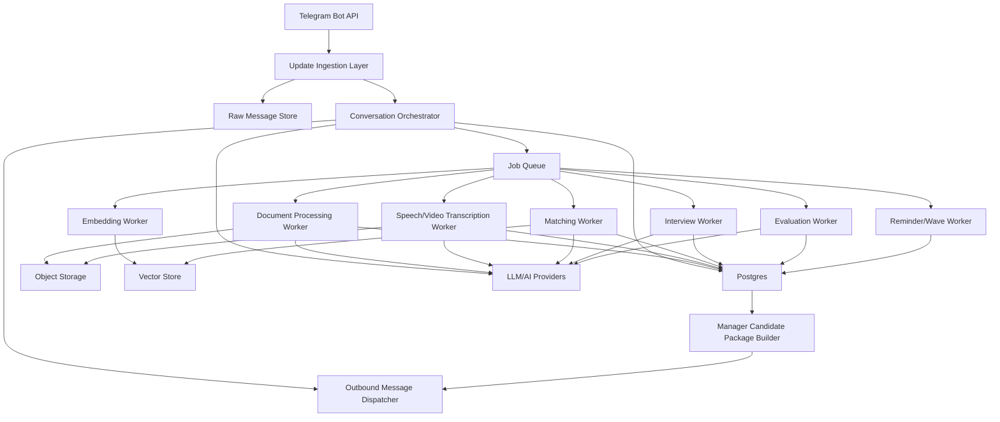

# HELLY v1 Architecture Blueprint

Target Architecture and Engineering Design Baseline

Version: 1.0  
Date: 2026-03-07

## 1. Purpose

This document translates the product SRS into a target implementation architecture for Helly v1.

It defines:

- architectural principles
- service boundaries
- data and control flows
- infrastructure baseline
- AI orchestration model
- reliability and quality controls

This document is intended to be stable enough to anchor engineering decomposition, but flexible enough to allow provider substitutions.

## 2. Design Goals

Helly v1 architecture must optimize for:

- deterministic workflow control
- Telegram-native user interaction
- multimodal input ingestion
- asynchronous heavy processing
- explainable AI decisions
- traceability of all business-critical events
- safe retries and idempotent update handling
- moderate scale without premature microservice complexity

## 3. Recommended Architecture Style

Recommended style for v1:

- modular monolith application
- asynchronous worker subsystem
- relational database as source of truth
- object storage for binary artifacts
- vector storage for semantic matching
- explicit internal service interfaces

Reasoning:

- Helly has meaningful complexity, but not enough scale in v1 to justify many independently deployed services
- stateful, transactional flows are easier to reason about in a modular monolith
- AI and parsing workloads still benefit from out-of-band worker execution

## 4. Core Principles

## 4.1 Database-Backed State Machines

All journey progression must be represented by explicit persisted states.

Core persisted state machines:

- candidate profile
- vacancy
- interview session
- match/invitation lifecycle

The state machine must remain authoritative over flow progression.

## 4.2 LLM as Controlled Subsystem

LLMs are not orchestration engines in Helly. They are controlled reasoning services used for:

- extraction
- normalization
- response drafting
- reranking
- interview generation
- evaluation

All LLM outputs must be validated before business writes.

## 4.3 State-Aware Conversation Over Deterministic Flow

Helly should use AI inside each active state, not instead of the state machine.

Target control pattern:

1. backend resolves current state
2. backend resolves allowed actions for that state
3. AI interprets the user message inside that state
4. AI returns a bounded response strategy and optional proposed action
5. backend validates the proposal
6. backend either keeps the same state or performs a valid transition

This pattern allows helpful behavior such as suggesting pasted or voice experience if the candidate has no CV, while still preventing prompt-driven state mutation.

## 4.4 Raw Artifact Preservation

All inbound content must be stored in raw form before destructive transformation or summarization.

This includes:

- Telegram payload
- extracted text
- transcripts
- parsed structured outputs
- prompt/response traces where policy allows

## 4.5 Async by Default for Heavy Work

The following must run asynchronously:

- document extraction
- media transcription
- embedding generation
- matching
- reranking
- interview evaluation
- reminders and wave escalation

Telegram reply latency must not depend on long-running jobs.

## 4.6 Provider Abstraction

Every external AI-capable dependency must be hidden behind internal interfaces.

This avoids coupling architecture to a single repository demo or vendor SDK.

## 5. High-Level System Diagram



## 6. Logical Modules

The codebase should be organized by bounded modules, even if deployed as one service.

## 6.1 `telegram`

Responsibilities:

- webhook or long-polling endpoint
- Telegram payload verification and normalization
- update deduplication
- outbound message formatting
- file metadata retrieval from Telegram

Key outputs:

- normalized inbound command/event
- raw message persistence
- retry-safe outbound delivery

## 6.2 `identity`

Responsibilities:

- user lookup by Telegram identity
- contact capture and normalization
- role linkage

## 6.3 `conversation`

Responsibilities:

- route inbound events to active flow handlers
- enforce allowed actions by current state
- request next required step
- recover from unsupported input
- coordinate with parsing and worker jobs
- invoke LangGraph stage agents for the active workflow stage
- validate proposed actions before any persisted transition

## 6.4 `candidate_profile`

Responsibilities:

- candidate onboarding state machine
- summary approval cycle
- mandatory field collection
- verification phrase issuance
- ready-state validation
- candidate deletion flow

## 6.5 `vacancy`

Responsibilities:

- vacancy creation state machine
- job description extraction
- clarification questions
- open-state validation
- vacancy deletion flow

## 6.6 `files`

Responsibilities:

- file registration
- object storage upload/download
- content hash and deduplication metadata
- artifact retrieval for downstream processing

## 6.7 `llm`

Responsibilities:

- prompt asset loading/versioning
- structured output schemas
- model routing
- provider abstraction
- tracing hooks

## 6.8 `parsing`

Responsibilities:

- document text extraction
- transcript generation
- field normalization
- extraction status tracking

## 6.9 `matching`

Responsibilities:

- hard filters
- candidate and vacancy embedding refresh
- vector retrieval
- deterministic scoring
- LLM reranking
- match persistence
- wave candidate selection

## 6.10 `interview`

Responsibilities:

- invitation lifecycle
- question plan generation
- question progression
- follow-up enforcement
- reminder and timeout logic
- session completion

## 6.11 `evaluation`

Responsibilities:

- interview post-processing
- final candidate scoring
- risk summary generation
- auto-rejection policy
- manager package assembly inputs

## 6.12 `notifications`

Responsibilities:

- invitation dispatch
- reminder dispatch
- manager delivery notifications
- approval/rejection messages
- introduction messages

## 6.13 `jobs`

Responsibilities:

- enqueue domain jobs
- retry policy
- dead-letter handling
- scheduled wave and reminder execution

## 6.14 `observability`

Responsibilities:

- structured logging
- metrics
- AI trace correlation
- state transition audit

## 7. Recommended Runtime Components

## 7.1 Application API / Bot Service

A single backend service should initially host:

- Telegram ingress endpoint
- conversation orchestration
- domain services
- synchronous validation paths
- job enqueueing

## 7.2 Worker Service

One or more worker processes should execute asynchronous jobs:

- document parsing
- transcription
- embeddings
- matching
- evaluation
- reminders

Workers can be separate process types in the same codebase.

## 7.3 Database

Recommended primary database:

- Supabase-managed PostgreSQL

Reasoning:

- transactional integrity
- robust indexing
- support for JSONB fields
- strong fit for event/state logging
- support for vector extension if desired

## 7.4 Object Storage

Recommended:

- Supabase Storage as the default v1 object storage layer

Used for:

- CV files
- JD files
- voice files
- video files
- verification videos
- exported package artifacts if needed

## 7.5 Vector Storage

Recommended options:

- Supabase PostgreSQL with `pgvector` for simplicity
- dedicated vector DB only if retrieval load or operations require it later

For v1, `pgvector` is likely sufficient and reduces system count.

## 7.6 Queue

Recommended:

- Redis-backed job queue or Postgres-backed queue with explicit retry semantics

Selection criteria:

- visibility into retries
- scheduled jobs support
- dead-letter capability
- low operational complexity

## 8. Recommended Technology Stack

This stack is recommended for Helly v1 unless the team has a stronger existing standard:

- Backend language: Python 3.12+
- Web framework: FastAPI
- ORM / DB access: SQLAlchemy 2.x or SQLModel if kept disciplined
- Migrations: Alembic
- Queue: Dramatiq, Celery, or RQ; prefer the one with the strongest operational familiarity
- Database: Supabase PostgreSQL
- Vector search: `pgvector`
- Object storage: Supabase Storage
- Validation: Pydantic v2
- Telegram client: direct Bot API wrapper or a thin Telegram SDK, but keep Telegram gateway isolated
- Hosting: Railway
- Primary LLM provider: OpenAI
- Testing: pytest
- Observability: OpenTelemetry and/or Opik for AI traces

Why this stack fits:

- strong Python AI ecosystem
- easy integration with LLM providers and extraction tools
- good support for schema validation and async APIs
- practical for modular monolith plus worker design

## 9. Control Flow Architecture

## 9.1 Inbound Message Processing

Every Telegram update should follow this flow:

1. Receive update from Telegram.
2. Persist raw update and dedupe by Telegram update ID.
3. Normalize message/event into internal event model.
4. Resolve user and active role/session.
5. Load current relevant state machine.
6. Validate whether the incoming action is allowed.
7. Either:
   - handle synchronously and respond, or
   - enqueue background work and respond with acknowledgment.
8. Persist resulting state transitions and emitted domain events.

## 9.2 Async Processing Pattern

Heavy jobs should follow this pattern:

1. Store a job request with correlation IDs.
2. Worker claims job.
3. Worker loads required domain state.
4. Worker calls external provider(s).
5. Worker validates outputs.
6. Worker writes result atomically.
7. Worker emits follow-up domain event or notification.

## 9.3 Outbound Message Processing

Outbound delivery should be decoupled from core logic.

Suggested pattern:

1. domain service emits notification intent
2. intent is persisted
3. notification dispatcher sends Telegram message
4. result is logged
5. failure is retried with backoff

## 10. Candidate Flow Architecture

## 10.1 Candidate Onboarding Stages

Suggested main progression:

- `NEW`
- `CONTACT_COLLECTED`
- `CONSENTED`
- `ROLE_CONFIRMED`
- `CV_PENDING`
- `CV_PROCESSING`
- `SUMMARY_REVIEW`
- `MANDATORY_QA`
- `VERIFICATION_PENDING`
- `READY`

### Synchronous work

- contact validation
- role selection
- summary approval response handling
- mandatory answer acceptance

### Asynchronous work

- CV extraction
- voice/video transcription
- structured summary generation

## 10.2 Candidate Summary Lifecycle

Flow:

1. candidate submits source artifact
2. file is stored
3. extraction/transcription job runs
4. structured candidate summary is produced
5. summary is presented to candidate
6. candidate approves or edits
7. edit patch is merged and versioned
8. approved summary becomes active profile summary

Design note:

Candidate summary should be versioned so later evaluation can reference the exact approved profile used for matching.

## 10.3 Candidate Verification Lifecycle

Flow:

1. system issues unique phrase
2. candidate uploads verification video
3. file and metadata are stored
4. verification requirement is marked completed
5. asset becomes part of future manager package

## 11. Vacancy Flow Architecture

## 11.1 Vacancy Intake Stages

Suggested progression:

- `NEW`
- `INTAKE_PENDING`
- `JD_PROCESSING`
- `CLARIFICATION_QA`
- `OPEN`

### Synchronous work

- manager identity confirmation
- clarification answer handling
- open-state validation

### Asynchronous work

- JD extraction
- voice/video transcription
- inconsistency detection
- embedding generation

## 11.2 Vacancy Activation Rules

Vacancy can move to `OPEN` only when:

- mandatory fields are present
- validation passed
- parser output exists or manual fallback data exists
- normalized fields for matching are available

Vacancy open event must trigger:

- embedding refresh
- matching job enqueue

## 12. Matching Architecture

## 12.1 Matching Pipeline Stages

Helly should implement matching as a multi-stage pipeline:

1. candidate/vacancy normalization
2. hard filter exclusion
3. embedding retrieval
4. deterministic scoring
5. LLM reranking
6. wave selection and invitation

## 12.2 Hard Filter Engine

Hard filter engine should be fully deterministic.

Inputs:

- candidate location
- vacancy countries allowed
- candidate salary expectation
- vacancy budget
- candidate work format
- vacancy work format
- candidate seniority
- vacancy seniority target

Hard filter engine output:

- pass/fail
- reason codes

Reason codes are important for analytics and operator review.

## 12.3 Embedding Layer

Separate embeddings should exist for:

- candidate profile semantic representation
- vacancy semantic representation

Embedding refresh triggers:

- approved summary changed
- mandatory fields changed in semantically relevant ways
- vacancy requirements changed

## 12.4 Deterministic Scoring Layer

Deterministic scoring should use a transparent formula.

Recommended first-wave scoring inputs:

- exact skill overlap
- partial skill overlap
- years of experience fit
- seniority fit
- core stack match
- domain or product context fit if available

This layer should be explainable without LLM interpretation.

## 12.5 LLM Reranking Layer

Reranking should only see candidates that already passed deterministic stages.

Input package:

- normalized vacancy summary
- normalized candidate summary
- deterministic score breakdown
- risk flags

Expected output:

- ordered shortlist
- concise rationale
- explicit strengths
- explicit concerns

The output must be schema-validated and stored.

## 13. Interview Architecture

## 13.1 Invitation Lifecycle

Suggested states:

- `PENDING_INVITE`
- `INVITED`
- `ACCEPTED`
- `SKIPPED`
- `EXPIRED`

Invitation must be tied to:

- one vacancy
- one candidate
- one wave number
- one expiration timestamp

## 13.2 Question Plan Generation

Question plan generation should use:

- vacancy must-haves
- candidate gaps from matching
- candidate claims needing verification

Question plan should be generated once per session and versioned.

## 13.3 Interview Progression Rules

For each question:

- accept text, voice, or video
- transcribe if needed
- store raw artifact and transcript
- optionally generate one follow-up
- forbid follow-up to follow-up

## 13.4 Session Recovery

If the candidate sends unrelated messages or pauses:

- session state must remain resumable
- next unanswered question must be derivable from persistent state

## 14. Evaluation Architecture

## 14.1 Evaluation Inputs

Evaluation worker should read:

- approved candidate profile summary version
- original extracted CV text or experience transcript
- vacancy normalized profile
- interview questions
- interview answers and transcripts
- previous match rationale

## 14.2 Evaluation Outputs

Evaluation result should contain:

- final score
- recommendation enum
- strengths list
- risks list
- missing requirement list
- summary for manager
- structured reasoning trace reference

## 14.3 Threshold Policy

Evaluation policy should support:

- global threshold defaults
- optional per-vacancy overrides
- auto-reject below threshold
- manager delivery threshold

## 15. Manager Package Architecture

Manager package builder should assemble:

- candidate summary
- original CV or candidate input artifact
- verification video
- interview summary
- evaluation summary

This package should be assembled from persisted artifacts, not from ad hoc recomputation.

## 16. Introduction Architecture

Since Telegram group/chat introduction methods may vary operationally, the system should implement introduction as a strategy interface.

Possible strategies:

- mediated bot handoff
- mutual contact delivery
- group creation if bot permissions and product policy allow

The introduction record should capture which strategy was used.

## 17. Data Architecture

## 17.1 Main Tables

Recommended primary tables:

- `users`
- `candidate_profiles`
- `candidate_profile_versions`
- `candidate_verifications`
- `vacancies`
- `vacancy_versions`
- `matches`
- `interview_sessions`
- `interview_questions`
- `interview_answers`
- `evaluation_results`
- `files`
- `raw_messages`
- `state_transition_logs`
- `notifications`
- `job_execution_logs`

## 17.2 Versioning Strategy

Use explicit version tables for mutable AI-derived artifacts:

- candidate summary versions
- vacancy normalized profile versions
- interview question plan versions if regenerated

This is necessary for:

- auditability
- reproducibility
- evaluation debugging

## 17.3 Event Logging

Every important business mutation should emit a structured event.

Recommended event classes:

- user identity events
- candidate state events
- vacancy state events
- file ingestion events
- parsing events
- matching events
- invitation events
- interview events
- evaluation events
- notification events

## 18. AI Architecture

## 18.1 AI Capability Catalog

Helly should explicitly catalog its AI capabilities:

- `candidate_cv_extract`
- `candidate_summary_merge`
- `candidate_field_parse`
- `vacancy_jd_extract`
- `vacancy_field_parse`
- `vacancy_inconsistency_detect`
- `interview_question_plan`
- `interview_followup_decision`
- `interview_answer_parse`
- `candidate_rerank`
- `candidate_evaluate`
- `response_copywriter`

Each capability should define:

- input schema
- output schema
- prompt asset
- model policy
- fallback behavior
- evaluation dataset owner

## 18.2 Prompt Asset Layout

Recommended repository layout:

```text
prompts/
  candidate/
    cv_extract/
    summary_merge/
    mandatory_field_parse/
  vacancy/
    jd_extract/
    clarification_parse/
    inconsistency_detect/
  interview/
    question_plan/
    followup/
    answer_parse/
  matching/
    rerank/
  evaluation/
    candidate_evaluate/
  messaging/
    recovery/
    small_talk/
```

Each prompt asset should include:

- prompt text
- schema contract
- examples
- version
- notes

## 18.3 Model Routing Strategy

Recommended split:

- small/cheap model for extraction and classification when quality permits
- stronger model for reranking and final evaluation
- specialized provider for speech transcription if needed

This should remain configurable.

## 18.4 Validation Strategy

Every AI output must pass:

- schema validation
- domain validation
- state-context validation

Example:

If a parsed work format output is outside allowed enum values, it must not mutate the profile.

## 19. Reliability Architecture

## 19.1 Idempotency

Required idempotency keys:

- Telegram update ID
- outbound notification intent ID
- job execution key for retry-safe tasks

Duplicate inbound updates must be no-ops or merge-safe.

## 19.2 Transaction Boundaries

Recommended approach:

- persist state transition and emitted event in one transaction
- enqueue follow-up async work via outbox pattern if feasible

This reduces lost-message and double-processing risks.

## 19.3 Retry Policy

Retry-safe jobs:

- parsing
- embedding
- reranking
- evaluation
- notifications

Potentially unsafe jobs require idempotency guards:

- invitation creation
- introduction creation
- manager delivery

## 19.4 Dead-Letter Strategy

Jobs that fail repeatedly should move to a reviewable dead-letter state with:

- last error
- correlation IDs
- entity references
- retry count

## 20. Security and Privacy Architecture

## 20.1 Sensitive Data Classes

Sensitive data in Helly includes:

- personal contact information
- CVs and employment history
- salary expectations
- location data
- candidate verification videos
- interview answers
- manager hiring requirements

## 20.2 Access Policy

The system should enforce:

- private object storage by default
- signed/time-limited access for file retrieval
- separation between raw artifacts and public summaries

## 20.3 Deletion Semantics

Recommended v1 policy:

- soft-delete primary entities
- immediately exclude deleted entities from active flows
- asynchronously purge or restrict access to files according to policy

## 21. Observability Architecture

## 21.1 Logging

Use structured logs with at least:

- timestamp
- request ID
- user ID
- chat ID
- entity IDs
- state before/after
- job ID
- prompt version
- model name

## 21.2 Metrics

Recommended initial metrics:

- inbound update count
- duplicate update rate
- parse failure rate
- transcription failure rate
- candidate onboarding completion rate
- vacancy activation rate
- match generation latency
- invitation acceptance rate
- interview completion rate
- auto-rejection rate
- manager approval rate

## 21.3 AI Tracing

Every important AI call should track:

- capability name
- model
- prompt version
- latency
- token usage
- validation result
- linked entity IDs

## 22. Testing Architecture

## 22.1 Unit Tests

Must cover:

- state transitions
- validation rules
- hard filters
- scoring logic
- deletion side effects

## 22.2 Integration Tests

Must cover:

- Telegram update ingestion
- candidate onboarding flow
- vacancy onboarding flow
- async job result application
- invitation and interview lifecycle

## 22.3 AI Contract Tests

Must cover:

- schema adherence
- prompt regression checks
- fallback behavior on malformed model output

## 22.4 End-to-End Tests

Must cover:

- candidate ready path
- vacancy open path
- matching to invitation to interview to manager review path

## 23. Recommended Initial Deployment Shape

Initial production deployment can be:

- one API service on Railway
- one worker service on Railway
- one scheduler/beat process on Railway if queue requires it
- Supabase PostgreSQL
- Redis if chosen queue requires it
- Supabase Storage

This is sufficient for v1 while preserving clean later extraction into services if necessary.

## 24. Anti-Patterns to Avoid

Helly should explicitly avoid:

- putting business truth into prompts only
- using one giant orchestrator prompt for all flows
- using open-ended multi-agent frameworks to control transactional onboarding without backend validation
- embedding vendor SDK calls deep in domain logic
- recomputing critical package artifacts on the fly without version control
- synchronous Telegram request handling for heavy AI tasks

## 25. Next Design Documents Needed

This blueprint should be followed by:

- detailed ERD/schema document
- state machine transition tables
- prompt catalog
- AI evaluation plan
- event taxonomy
- API/internal contract spec
- operations runbook

## 26. Final Architectural Position

Helly v1 should be implemented as a stateful, AI-assisted recruiting system with a deterministic application core.

The correct architecture is not "an AI agent that recruits." The correct architecture is:

- a recruiting workflow engine
- with multimodal ingestion
- using LLMs for bounded reasoning tasks
- under explicit state, audit, retry, and validation controls

That distinction should remain intact through implementation.
