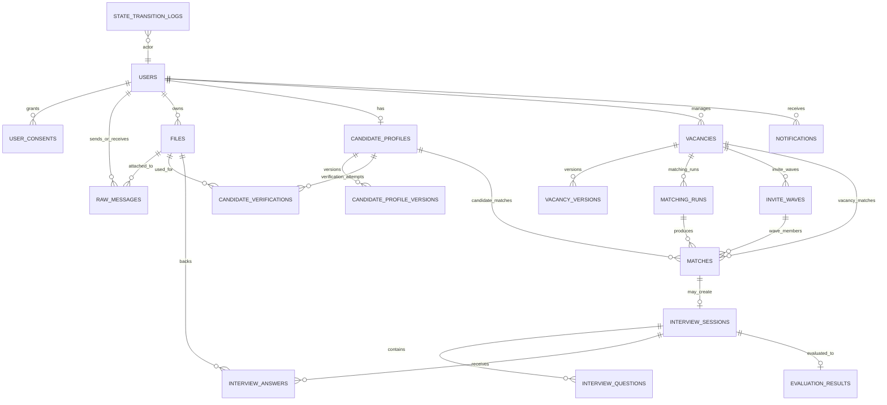

# HELLY v1 Data Model and ERD

Physical Schema Design Baseline

Version: 1.0  
Date: 2026-03-07

## 1. Purpose

This document defines the recommended physical data model for Helly v1.

It extends the high-level entity list from the SRS into implementation-oriented design:

- table boundaries
- primary and foreign keys
- recommended PostgreSQL types
- important indexes and constraints
- versioning strategy
- retention and audit rules

This document is a baseline for migrations and repository/entity design. It is intentionally opinionated so implementation does not drift into inconsistent storage patterns.

## 2. Design Principles

## 2.1 PostgreSQL as Source of Truth

Primary operational truth must live in PostgreSQL.

This includes:

- user identity
- business state
- AI-derived current profile data
- audit logs
- notification intents
- job execution metadata

## 2.2 Binary Files Outside the Database

Raw binaries should live in object storage, not inside PostgreSQL.

PostgreSQL stores:

- file metadata
- ownership
- storage location
- integrity hashes
- provider IDs

## 2.3 Version AI-Derived Artifacts

The following should be versioned explicitly:

- candidate profile summary artifacts
- vacancy normalized profile artifacts
- interview question plans
- evaluation outputs if reevaluation is allowed

## 2.4 Stable IDs, Soft Deletes, and Auditability

All primary entities should use immutable UUIDs.

Soft delete is recommended for:

- users
- candidate profiles
- vacancies

Deletion must remove entities from active processing immediately even if raw records are retained.

## 2.5 JSONB for Flexible AI Outputs, Columns for Operational Filters

Use JSONB for:

- structured extraction payloads
- provider metadata
- prompt/model traces
- detailed score explanations

Use typed columns for:

- state
- budget
- salary
- country
- work format
- timestamps
- status filters

Do not hide query-critical fields inside JSONB.

## 3. Global Conventions

## 3.1 Primary Keys

Every primary table should use:

- `id UUID PRIMARY KEY`

## 3.2 Timestamps

Use:

- `created_at TIMESTAMPTZ NOT NULL DEFAULT now()`
- `updated_at TIMESTAMPTZ NOT NULL DEFAULT now()`

If the row has lifecycle edges, add explicit timestamps such as:

- `ready_at`
- `opened_at`
- `deleted_at`
- `sent_at`
- `completed_at`

## 3.3 Soft Delete Convention

Soft-deletable rows should use:

- `deleted_at TIMESTAMPTZ NULL`

Business queries for active entities should always filter on `deleted_at IS NULL`.

## 3.4 Suggested Enum Strategy

Use PostgreSQL enums only for highly stable values. Use constrained text if values may evolve rapidly.

Recommended enum-like categories:

- role type
- candidate profile state
- vacancy state
- match state
- invitation status
- interview session state
- notification status
- file kind
- message direction

## 4. Core Entity Relationship Diagram

## 5. Table Catalog

## 5.1 `users`

Purpose:

- stable Telegram-linked identity record

Recommended columns:

| Column | Type | Null | Notes |
| --- | --- | --- | --- |
| `id` | `uuid` | no | primary key |
| `telegram_user_id` | `bigint` | no | unique Telegram user identifier |
| `telegram_chat_id` | `bigint` | yes | most recent primary chat ID |
| `phone_number` | `text` | yes | normalized E.164 if possible |
| `display_name` | `text` | yes | Telegram name snapshot |
| `username` | `text` | yes | Telegram handle |
| `language_code` | `text` | yes | Telegram locale hint |
| `timezone` | `text` | yes | optional, inferred or set later |
| `is_candidate` | `boolean` | no | role flag |
| `is_hiring_manager` | `boolean` | no | role flag |
| `created_at` | `timestamptz` | no | default now |
| `updated_at` | `timestamptz` | no | default now |
| `deleted_at` | `timestamptz` | yes | soft delete |

Constraints and indexes:

- unique index on `telegram_user_id`
- index on `phone_number`
- partial index on active users: `deleted_at IS NULL`

## 5.2 `user_consents`

Purpose:

- auditable consent trail rather than a single flag only

Recommended columns:

| Column | Type | Null | Notes |
| --- | --- | --- | --- |
| `id` | `uuid` | no | primary key |
| `user_id` | `uuid` | no | FK to `users.id` |
| `consent_type` | `text` | no | e.g. `data_processing`, `candidate_profile`, `manager_profile` |
| `granted` | `boolean` | no | granted or revoked |
| `policy_version` | `text` | yes | consent text version |
| `source_raw_message_id` | `uuid` | yes | FK to `raw_messages.id` |
| `granted_at` | `timestamptz` | no | event time |
| `created_at` | `timestamptz` | no | audit timestamp |

Indexes:

- index on `(user_id, consent_type, granted_at desc)`

## 5.3 `files`

Purpose:

- metadata registry for every file or generated artifact

Recommended columns:

| Column | Type | Null | Notes |
| --- | --- | --- | --- |
| `id` | `uuid` | no | primary key |
| `owner_user_id` | `uuid` | yes | FK to `users.id` |
| `source` | `text` | no | `telegram`, `generated`, `imported` |
| `kind` | `text` | no | `cv`, `jd`, `voice`, `video`, `verification_video`, `transcript`, `export` |
| `telegram_file_id` | `text` | yes | Telegram API file ref |
| `telegram_unique_file_id` | `text` | yes | Telegram unique file ref |
| `storage_key` | `text` | yes | object storage path |
| `mime_type` | `text` | yes | content type |
| `extension` | `text` | yes | normalized extension |
| `size_bytes` | `bigint` | yes | file size |
| `sha256` | `text` | yes | integrity / dedupe |
| `provider_metadata` | `jsonb` | yes | raw provider-specific fields |
| `status` | `text` | no | `registered`, `uploaded`, `processed`, `failed`, `deleted` |
| `created_at` | `timestamptz` | no | default now |
| `updated_at` | `timestamptz` | no | default now |
| `deleted_at` | `timestamptz` | yes | soft delete |

Indexes:

- index on `owner_user_id`
- index on `telegram_unique_file_id`
- unique index on `sha256` only if dedupe policy wants strong global dedupe
- index on `kind`

## 5.4 `raw_messages`

Purpose:

- immutable log of inbound and outbound Telegram messages/updates

Recommended columns:

| Column | Type | Null | Notes |
| --- | --- | --- | --- |
| `id` | `uuid` | no | primary key |
| `user_id` | `uuid` | yes | FK to `users.id` |
| `telegram_update_id` | `bigint` | yes | unique for inbound updates |
| `telegram_message_id` | `bigint` | yes | Telegram message ID |
| `telegram_chat_id` | `bigint` | yes | target chat |
| `direction` | `text` | no | `inbound` or `outbound` |
| `content_type` | `text` | no | `text`, `document`, `voice`, `video`, `contact`, etc. |
| `payload_json` | `jsonb` | no | full raw payload |
| `text_content` | `text` | yes | extracted message text if any |
| `file_id` | `uuid` | yes | FK to `files.id` |
| `correlation_id` | `uuid` | yes | request/job correlation |
| `created_at` | `timestamptz` | no | persistence time |

Constraints and indexes:

- unique index on `telegram_update_id` where not null
- index on `(user_id, created_at desc)`
- index on `(telegram_chat_id, created_at desc)`
- GIN index on `payload_json` only if operationally justified

## 5.5 `candidate_profiles`

Purpose:

- operational candidate state and normalized current fields

Recommended columns:

| Column | Type | Null | Notes |
| --- | --- | --- | --- |
| `id` | `uuid` | no | primary key |
| `user_id` | `uuid` | no | FK to `users.id` |
| `state` | `text` | no | candidate profile state |
| `current_version_id` | `uuid` | yes | FK to `candidate_profile_versions.id` |
| `salary_min` | `numeric(12,2)` | yes | normalized salary floor |
| `salary_max` | `numeric(12,2)` | yes | normalized salary ceiling |
| `salary_currency` | `text` | yes | ISO currency code |
| `salary_period` | `text` | yes | `month`, `year`, etc. |
| `location_text` | `text` | yes | human-readable location |
| `country_code` | `text` | yes | normalized ISO country code |
| `city` | `text` | yes | optional |
| `work_format` | `text` | yes | `remote`, `hybrid`, `office` |
| `seniority_normalized` | `text` | yes | `junior`, `middle`, `senior`, `lead` |
| `target_role` | `text` | yes | normalized role title |
| `primary_skills` | `text[]` | yes | operational skill index |
| `embedding` | `vector` | yes | if using `pgvector` on current profile |
| `ready_at` | `timestamptz` | yes | ready timestamp |
| `deleted_at` | `timestamptz` | yes | soft delete |
| `created_at` | `timestamptz` | no | default now |
| `updated_at` | `timestamptz` | no | default now |

Constraints and indexes:

- unique index on active profile per user
- index on `state`
- index on `(country_code, work_format, seniority_normalized)`
- GIN index on `primary_skills`

## 5.6 `candidate_profile_versions`

Purpose:

- immutable snapshots of AI-derived and user-approved candidate profile data

Recommended columns:

| Column | Type | Null | Notes |
| --- | --- | --- | --- |
| `id` | `uuid` | no | primary key |
| `profile_id` | `uuid` | no | FK to `candidate_profiles.id` |
| `version_no` | `integer` | no | monotonically increasing |
| `source_type` | `text` | no | `cv_upload`, `voice_description`, `manual_edit`, `merge` |
| `source_file_id` | `uuid` | yes | FK to `files.id` |
| `extracted_text` | `text` | yes | parsed raw text |
| `transcript_text` | `text` | yes | speech transcript if applicable |
| `summary_json` | `jsonb` | no | structured approved summary |
| `normalization_json` | `jsonb` | yes | normalized fields and parser trace |
| `approval_status` | `text` | no | `draft`, `approved`, `superseded` |
| `approved_by_user` | `boolean` | no | direct candidate approval flag |
| `prompt_version` | `text` | yes | extraction prompt version |
| `model_name` | `text` | yes | AI model used |
| `created_at` | `timestamptz` | no | default now |

Constraints and indexes:

- unique index on `(profile_id, version_no)`
- index on `(profile_id, created_at desc)`
- partial index on approved versions

## 5.7 `candidate_verifications`

Purpose:

- verification phrase issuance and uploaded verification asset tracking

Recommended columns:

| Column | Type | Null | Notes |
| --- | --- | --- | --- |
| `id` | `uuid` | no | primary key |
| `profile_id` | `uuid` | no | FK to `candidate_profiles.id` |
| `attempt_no` | `integer` | no | sequence per profile |
| `phrase_text` | `text` | no | phrase candidate must say |
| `status` | `text` | no | `issued`, `submitted`, `accepted`, `replaced`, `failed` |
| `video_file_id` | `uuid` | yes | FK to `files.id` |
| `issued_at` | `timestamptz` | no | phrase issuance time |
| `submitted_at` | `timestamptz` | yes | upload time |
| `review_notes_json` | `jsonb` | yes | future automation/manual review |
| `created_at` | `timestamptz` | no | default now |

Indexes:

- index on `(profile_id, attempt_no)`
- partial index on active/latest attempt

## 5.8 `vacancies`

Purpose:

- operational vacancy state and normalized current fields

Recommended columns:

| Column | Type | Null | Notes |
| --- | --- | --- | --- |
| `id` | `uuid` | no | primary key |
| `manager_user_id` | `uuid` | no | FK to `users.id` |
| `state` | `text` | no | vacancy state |
| `current_version_id` | `uuid` | yes | FK to `vacancy_versions.id` |
| `title` | `text` | yes | normalized title |
| `budget_min` | `numeric(12,2)` | yes | normalized budget |
| `budget_max` | `numeric(12,2)` | yes | normalized budget |
| `budget_currency` | `text` | yes | ISO currency code |
| `work_format` | `text` | yes | `remote`, `hybrid`, `office` |
| `countries_allowed` | `text[]` | yes | ISO country code list |
| `team_size` | `integer` | yes | normalized integer |
| `project_description` | `text` | yes | current normalized description |
| `primary_stack` | `text[]` | yes | normalized tech stack |
| `seniority_target` | `text` | yes | normalized target |
| `embedding` | `vector` | yes | if using `pgvector` on current vacancy |
| `opened_at` | `timestamptz` | yes | transition to `OPEN` |
| `closed_at` | `timestamptz` | yes | vacancy end |
| `deleted_at` | `timestamptz` | yes | soft delete |
| `created_at` | `timestamptz` | no | default now |
| `updated_at` | `timestamptz` | no | default now |

Indexes:

- index on `(manager_user_id, state)`
- GIN index on `countries_allowed`
- GIN index on `primary_stack`
- index on `opened_at`

## 5.9 `vacancy_versions`

Purpose:

- immutable snapshots of AI-derived and clarified vacancy profile data

Recommended columns:

| Column | Type | Null | Notes |
| --- | --- | --- | --- |
| `id` | `uuid` | no | primary key |
| `vacancy_id` | `uuid` | no | FK to `vacancies.id` |
| `version_no` | `integer` | no | monotonically increasing |
| `source_type` | `text` | no | `jd_upload`, `voice_submission`, `manual_clarification`, `merge` |
| `source_file_id` | `uuid` | yes | FK to `files.id` |
| `extracted_text` | `text` | yes | parsed JD text |
| `transcript_text` | `text` | yes | if source was voice/video |
| `summary_json` | `jsonb` | no | structured vacancy summary |
| `normalization_json` | `jsonb` | yes | normalized filters and matching fields |
| `inconsistency_json` | `jsonb` | yes | detected risks/conflicts |
| `approval_status` | `text` | no | `draft`, `active`, `superseded` |
| `prompt_version` | `text` | yes | extraction prompt version |
| `model_name` | `text` | yes | AI model used |
| `created_at` | `timestamptz` | no | default now |

Constraints and indexes:

- unique index on `(vacancy_id, version_no)`
- index on `(vacancy_id, created_at desc)`
- partial index on active versions

## 5.10 `matching_runs`

Purpose:

- audit unit for each end-to-end matching execution

Recommended columns:

| Column | Type | Null | Notes |
| --- | --- | --- | --- |
| `id` | `uuid` | no | primary key |
| `vacancy_id` | `uuid` | no | FK to `vacancies.id` |
| `trigger_type` | `text` | no | `vacancy_opened`, `candidate_ready`, `profile_updated`, `manual` |
| `trigger_ref_id` | `uuid` | yes | entity that caused rerun |
| `status` | `text` | no | `queued`, `running`, `completed`, `failed` |
| `candidate_pool_size` | `integer` | yes | post hard-filter size |
| `retrieved_count` | `integer` | yes | embedding retrieval count |
| `reranked_count` | `integer` | yes | candidates passed to reranking |
| `error_text` | `text` | yes | failure reason |
| `created_at` | `timestamptz` | no | default now |
| `started_at` | `timestamptz` | yes | worker start |
| `finished_at` | `timestamptz` | yes | worker finish |

Indexes:

- index on `(vacancy_id, created_at desc)`
- index on `status`

## 5.11 `invite_waves`

Purpose:

- auditable record of interview invitation waves per vacancy

Recommended columns:

| Column | Type | Null | Notes |
| --- | --- | --- | --- |
| `id` | `uuid` | no | primary key |
| `vacancy_id` | `uuid` | no | FK to `vacancies.id` |
| `wave_no` | `integer` | no | wave sequence |
| `status` | `text` | no | `planned`, `active`, `closed`, `cancelled` |
| `planned_invite_count` | `integer` | no | configuration snapshot |
| `min_completed_target` | `integer` | yes | completion target |
| `opened_at` | `timestamptz` | yes | activation time |
| `closed_at` | `timestamptz` | yes | close time |
| `metadata_json` | `jsonb` | yes | policy snapshot |
| `created_at` | `timestamptz` | no | default now |

Constraints and indexes:

- unique index on `(vacancy_id, wave_no)`
- index on `(vacancy_id, status)`

## 5.12 `matches`

Purpose:

- candidate-vacancy relationship record across matching, invitation, interview, and review lifecycle

Recommended columns:

| Column | Type | Null | Notes |
| --- | --- | --- | --- |
| `id` | `uuid` | no | primary key |
| `vacancy_id` | `uuid` | no | FK to `vacancies.id` |
| `candidate_profile_id` | `uuid` | no | FK to `candidate_profiles.id` |
| `candidate_profile_version_id` | `uuid` | no | snapshot used for scoring |
| `vacancy_version_id` | `uuid` | no | snapshot used for scoring |
| `matching_run_id` | `uuid` | yes | FK to `matching_runs.id` |
| `invite_wave_id` | `uuid` | yes | FK to `invite_waves.id` |
| `status` | `text` | no | `filtered_out`, `shortlisted`, `invited`, `accepted`, `skipped`, `expired`, `interview_completed`, `auto_rejected`, `manager_review`, `approved`, `rejected` |
| `hard_filter_pass` | `boolean` | no | eligibility result |
| `hard_filter_reason_codes` | `text[]` | yes | deterministic reason codes |
| `embedding_score` | `double precision` | yes | vector similarity score |
| `deterministic_score` | `double precision` | yes | rules score |
| `deterministic_breakdown_json` | `jsonb` | yes | explanation object |
| `llm_rank_score` | `double precision` | yes | reranking score |
| `llm_rank_position` | `integer` | yes | shortlist rank |
| `llm_reasoning_json` | `jsonb` | yes | strengths and gaps |
| `invitation_status` | `text` | yes | `pending`, `sent`, `accepted`, `skipped`, `expired`, `cancelled` |
| `invited_at` | `timestamptz` | yes | notification dispatch time |
| `responded_at` | `timestamptz` | yes | candidate response time |
| `reviewed_at` | `timestamptz` | yes | manager decision time |
| `created_at` | `timestamptz` | no | default now |
| `updated_at` | `timestamptz` | no | default now |

Constraints and indexes:

- unique index on `(vacancy_id, candidate_profile_id)`
- index on `(vacancy_id, status)`
- index on `(candidate_profile_id, status)`
- index on `(invite_wave_id, invitation_status)`
- GIN index on `hard_filter_reason_codes`

## 5.13 `interview_sessions`

Purpose:

- one interview workflow instance for a match

Recommended columns:

| Column | Type | Null | Notes |
| --- | --- | --- | --- |
| `id` | `uuid` | no | primary key |
| `match_id` | `uuid` | no | FK to `matches.id` |
| `candidate_profile_id` | `uuid` | no | FK to `candidate_profiles.id` |
| `vacancy_id` | `uuid` | no | FK to `vacancies.id` |
| `state` | `text` | no | interview session state |
| `question_plan_version` | `integer` | no | current question plan number |
| `current_question_order` | `integer` | yes | resume pointer |
| `questions_total` | `integer` | yes | snapshot |
| `followups_used` | `integer` | no | total follow-ups used |
| `started_at` | `timestamptz` | yes | accepted/start time |
| `expires_at` | `timestamptz` | yes | timeout boundary |
| `completed_at` | `timestamptz` | yes | completion time |
| `abandoned_at` | `timestamptz` | yes | explicit stop |
| `created_at` | `timestamptz` | no | default now |
| `updated_at` | `timestamptz` | no | default now |

Constraints and indexes:

- unique index on `match_id`
- index on `(state, expires_at)`
- index on `(candidate_profile_id, state)`

## 5.14 `interview_questions`

Purpose:

- persistent interview plan and asked question history

Recommended columns:

| Column | Type | Null | Notes |
| --- | --- | --- | --- |
| `id` | `uuid` | no | primary key |
| `session_id` | `uuid` | no | FK to `interview_sessions.id` |
| `question_plan_version` | `integer` | no | supports regeneration or replay |
| `question_order` | `integer` | no | primary question order |
| `question_type` | `text` | no | `primary` or `followup` |
| `parent_question_id` | `uuid` | yes | self-FK for follow-up |
| `text` | `text` | no | question body |
| `goal` | `text` | yes | hidden purpose, e.g. skill verification |
| `source_gap_json` | `jsonb` | yes | why the question exists |
| `status` | `text` | no | `planned`, `asked`, `answered`, `skipped` |
| `asked_at` | `timestamptz` | yes | send time |
| `answered_at` | `timestamptz` | yes | answer completion time |
| `created_at` | `timestamptz` | no | default now |

Constraints and indexes:

- unique index on `(session_id, question_plan_version, question_type, question_order, parent_question_id)`
- index on `(session_id, status, question_order)`

## 5.15 `interview_answers`

Purpose:

- store candidate answers and their parsed/transcribed forms

Recommended columns:

| Column | Type | Null | Notes |
| --- | --- | --- | --- |
| `id` | `uuid` | no | primary key |
| `session_id` | `uuid` | no | FK to `interview_sessions.id` |
| `question_id` | `uuid` | no | FK to `interview_questions.id` |
| `raw_message_id` | `uuid` | yes | FK to `raw_messages.id` |
| `file_id` | `uuid` | yes | FK to `files.id` |
| `answer_format` | `text` | no | `text`, `voice`, `video` |
| `answer_text` | `text` | yes | direct text answer |
| `transcript_text` | `text` | yes | transcript for voice/video |
| `parsed_json` | `jsonb` | yes | extracted structured answer data |
| `transcription_confidence` | `double precision` | yes | optional provider output |
| `prompt_version` | `text` | yes | parse prompt version |
| `model_name` | `text` | yes | model used for parsing |
| `created_at` | `timestamptz` | no | default now |

Indexes:

- unique index on `(question_id)`
- index on `(session_id, created_at)`

## 5.16 `evaluation_results`

Purpose:

- final structured evaluation of a completed interview

Recommended columns:

| Column | Type | Null | Notes |
| --- | --- | --- | --- |
| `id` | `uuid` | no | primary key |
| `session_id` | `uuid` | no | FK to `interview_sessions.id` |
| `match_id` | `uuid` | no | FK to `matches.id` |
| `candidate_profile_version_id` | `uuid` | no | snapshot evaluated |
| `vacancy_version_id` | `uuid` | no | snapshot evaluated |
| `final_score` | `double precision` | no | normalized score |
| `recommendation` | `text` | no | `strong_yes`, `yes`, `mixed`, `no` |
| `strengths_json` | `jsonb` | no | list of strengths |
| `risks_json` | `jsonb` | no | list of risks |
| `missing_requirements_json` | `jsonb` | yes | explicit gaps |
| `summary_text` | `text` | no | human-readable summary |
| `threshold_snapshot_json` | `jsonb` | yes | policy snapshot |
| `prompt_version` | `text` | yes | evaluation prompt version |
| `model_name` | `text` | yes | model used |
| `created_at` | `timestamptz` | no | default now |

Constraints and indexes:

- unique index on `session_id`
- unique index on `match_id`
- index on `recommendation`
- index on `final_score`

## 5.17 `notifications`

Purpose:

- durable outbound notification intents and delivery tracking

Recommended columns:

| Column | Type | Null | Notes |
| --- | --- | --- | --- |
| `id` | `uuid` | no | primary key |
| `user_id` | `uuid` | no | FK to `users.id` |
| `entity_type` | `text` | no | e.g. `match`, `interview_session`, `vacancy` |
| `entity_id` | `uuid` | no | target entity |
| `channel` | `text` | no | `telegram` |
| `template_key` | `text` | no | notification template |
| `payload_json` | `jsonb` | no | rendered or renderable payload |
| `status` | `text` | no | `pending`, `sending`, `sent`, `failed`, `cancelled` |
| `send_after` | `timestamptz` | yes | scheduled send |
| `sent_at` | `timestamptz` | yes | actual delivery time |
| `failure_count` | `integer` | no | retry count |
| `last_error` | `text` | yes | most recent error |
| `created_at` | `timestamptz` | no | default now |
| `updated_at` | `timestamptz` | no | default now |

Indexes:

- index on `(status, send_after)`
- index on `(user_id, created_at desc)`
- unique idempotency index may be added on `(entity_type, entity_id, template_key)` if needed

## 5.18 `state_transition_logs`

Purpose:

- append-only audit of state changes across major entities

Recommended columns:

| Column | Type | Null | Notes |
| --- | --- | --- | --- |
| `id` | `uuid` | no | primary key |
| `entity_type` | `text` | no | `candidate_profile`, `vacancy`, `match`, `interview_session` |
| `entity_id` | `uuid` | no | entity ref |
| `from_state` | `text` | yes | previous state |
| `to_state` | `text` | no | next state |
| `trigger_type` | `text` | no | `user_action`, `job_result`, `timeout`, `manager_action`, `system` |
| `trigger_ref_id` | `uuid` | yes | related raw message, job, or notification |
| `actor_user_id` | `uuid` | yes | direct actor if user-driven |
| `metadata_json` | `jsonb` | yes | validation or contextual details |
| `created_at` | `timestamptz` | no | default now |

Indexes:

- index on `(entity_type, entity_id, created_at)`
- index on `trigger_type`

## 5.19 `job_execution_logs`

Purpose:

- retry-safe tracking of asynchronous job execution

Recommended columns:

| Column | Type | Null | Notes |
| --- | --- | --- | --- |
| `id` | `uuid` | no | primary key |
| `job_type` | `text` | no | worker job name |
| `idempotency_key` | `text` | no | deterministic retry key |
| `entity_type` | `text` | yes | related entity type |
| `entity_id` | `uuid` | yes | related entity ID |
| `status` | `text` | no | `queued`, `running`, `succeeded`, `failed`, `dead_lettered` |
| `attempt_no` | `integer` | no | current attempt |
| `payload_json` | `jsonb` | yes | job snapshot |
| `result_json` | `jsonb` | yes | job result summary |
| `last_error` | `text` | yes | last failure |
| `queued_at` | `timestamptz` | no | enqueue time |
| `started_at` | `timestamptz` | yes | start time |
| `finished_at` | `timestamptz` | yes | end time |

Constraints and indexes:

- unique index on `(job_type, idempotency_key, attempt_no)`
- index on `(status, queued_at)`
- index on `(entity_type, entity_id)`

## 5.20 `outbox_events`

Purpose:

- reliable delivery bridge between transactions and async jobs/notifications

Recommended columns:

| Column | Type | Null | Notes |
| --- | --- | --- | --- |
| `id` | `uuid` | no | primary key |
| `event_type` | `text` | no | domain event name |
| `entity_type` | `text` | no | source entity type |
| `entity_id` | `uuid` | no | source entity ID |
| `payload_json` | `jsonb` | no | event payload |
| `status` | `text` | no | `pending`, `published`, `failed` |
| `available_at` | `timestamptz` | no | scheduling support |
| `published_at` | `timestamptz` | yes | dispatch time |
| `failure_count` | `integer` | no | retries |
| `last_error` | `text` | yes | failure reason |
| `created_at` | `timestamptz` | no | default now |

Indexes:

- index on `(status, available_at)`
- index on `(entity_type, entity_id)`

## 6. Relationship Rules

Critical relationship rules:

- one active candidate profile per user
- one manager can own multiple vacancies
- one vacancy can have many match rows
- one match can create at most one active interview session in v1
- one completed session can produce at most one active evaluation result
- match rows must reference the exact candidate and vacancy version used for scoring

## 7. Recommended State Storage Policy

Store current operational state in parent entity tables:

- `candidate_profiles.state`
- `vacancies.state`
- `matches.status`
- `interview_sessions.state`

Store historical changes in:

- `state_transition_logs`

Do not reconstruct current state solely from the log in v1.

## 8. Recommended Index Strategy

Indexes with the highest likely ROI:

- `raw_messages.telegram_update_id`
- `candidate_profiles.state`
- `vacancies.state`
- `matches(vacancy_id, status)`
- `matches(candidate_profile_id, status)`
- `interview_sessions(state, expires_at)`
- `notifications(status, send_after)`
- `job_execution_logs(status, queued_at)`
- GIN on array fields like `primary_skills`, `countries_allowed`, `primary_stack`

If using `pgvector`, add ANN indexes only after profile volume is meaningful and exact scan becomes too slow.

## 9. Data Retention Guidance

Recommended v1 policy:

- raw messages: retain for audit and debugging according to privacy policy
- file metadata: retain while corresponding business entity remains retained
- deleted profiles: immediately excluded from matching, retained per policy
- verification videos: access-restricted and not exposed except in manager package flow
- AI traces: retain enough for debugging and evaluation but minimize unnecessary personal data duplication

## 10. Example Event-to-Table Write Patterns

## 10.1 Candidate Uploads CV

Write sequence:

1. `raw_messages`
2. `files`
3. `job_execution_logs` enqueue record
4. `state_transition_logs` for `CV_PENDING -> CV_PROCESSING`

Job result writes:

1. `candidate_profile_versions`
2. `candidate_profiles.current_version_id`
3. `state_transition_logs` for `CV_PROCESSING -> SUMMARY_REVIEW`

## 10.2 Vacancy Opens

Write sequence:

1. update `vacancies` normalized fields and `state = OPEN`
2. insert `state_transition_logs`
3. insert `outbox_events` for embedding refresh and matching trigger

## 10.3 Candidate Accepts Interview

Write sequence:

1. `raw_messages`
2. update `matches.invitation_status = accepted`
3. insert `interview_sessions`
4. insert `interview_questions`
5. insert `state_transition_logs`

## 11. Migration Order Recommendation

Recommended migration order:

1. core identity and raw message tables
2. files and consents
3. candidate and vacancy parent tables
4. version tables
5. matching tables
6. interview tables
7. evaluation, notifications, logs, outbox

This order supports incremental implementation without circular migration pain.

## 12. Final Position

The data model should make three things easy:

- operational queries over current business state
- auditable reconstruction of important decisions
- safe asynchronous processing with retries

If a schema decision weakens one of those three, it is likely the wrong decision for Helly v1.
