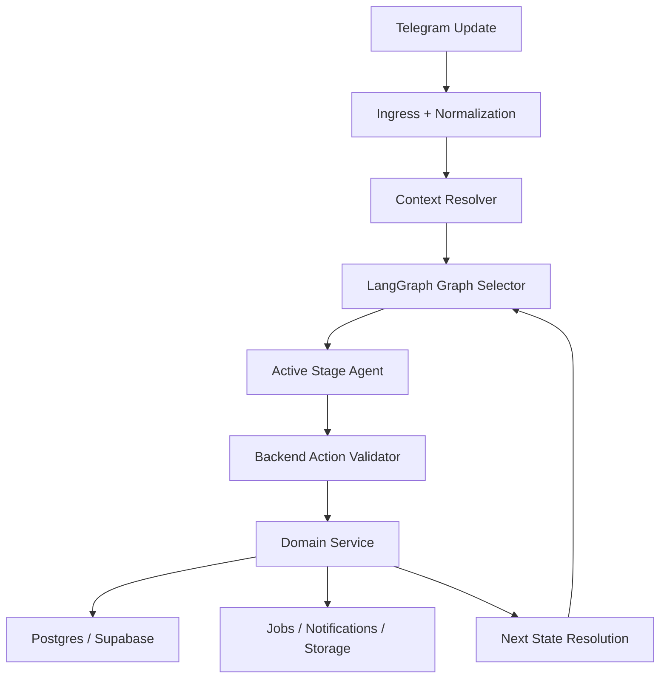

# HELLY v1 LangGraph Stage-Agent Architecture

LangGraph-Based Agent-per-Stage Orchestration

Version: 1.0  
Date: 2026-03-07

Canonical note:

- this document remains useful as the original LangGraph migration rationale
- the current canonical target architecture is now defined in `HELLY_V1_AGENT_OWNED_STAGE_ARCHITECTURE.md`

## 1. Purpose

This document defines the new target orchestration model for Helly v1.

It replaces the previous target of:

- deterministic state machines
- plus one shared state-aware assistance layer

with a new target:

- deterministic domain state machines remain the source of truth
- user-facing workflow execution is orchestrated through LangGraph
- each major workflow stage has its own bounded AI agent

The practical goal is:

- keep the flow strict and auditable
- make the bot feel much smarter inside every stage
- let the active stage agent explain, recover, guide, and parse input naturally
- avoid brittle handler behavior such as treating short help questions as business payloads

## 2. Architectural Decision

Helly should adopt:

- `LangGraph` as the orchestration runtime for user-facing workflow agents
- one bounded stage agent per major conversational stage
- explicit graph routing between stages
- backend validation before every persisted transition

Helly should not adopt:

- open-ended autonomous agent swarms
- free-form prompt-only workflow control
- uncontrolled tool execution by agents

The right target model is:

- `LangGraph graph`
- with `one bounded stage agent per active workflow stage`
- over `Postgres-backed domain state machines`

## 3. Core Rule

LangGraph will orchestrate conversation and bounded reasoning.

Postgres-backed backend services will still own:

- authoritative state
- persistence
- transitions
- constraints
- audit logging
- side effects

In short:

- LangGraph owns conversational orchestration
- backend owns business truth

## 4. Why This Change Is Needed

The current baseline improved the bot substantially, but it still has a structural weakness:

- one global assistance layer tries to help inside many states
- business handlers still sit outside that layer
- short or ambiguous user messages can still fall into the wrong path
- fallback behavior can still feel mechanical or low-quality

What is needed instead:

- the active stage must have its own local agent brain
- that stage agent must know:
  - what this stage is trying to achieve
  - what inputs count as valid completion
  - what questions users usually ask here
  - what alternatives are allowed
  - what recovery patterns are valid

That is much closer to:

- `hotel-booking-crew`
- `flight-booking-crew`

as a design pattern of:

- one agent per task boundary
- bounded responsibility
- explicit handoff to the next node

For Helly, the difference is:

- we should implement the pattern with `LangGraph`
- not with free-form multi-agent autonomy

## 5. Target Runtime Model

## 5.1 Global Flow

## 5.2 Stage Agent Responsibilities

Each stage agent is responsible only for the active stage.

A stage agent may:

- answer user questions about the current step
- explain why the step exists
- suggest allowed alternative inputs
- detect valid completion input
- structure user input for backend validation
- propose exactly one bounded action

Current direction update:

- the target is now stronger than a help-oriented stage assistant
- every major user-facing stage should become a full stage-owning agent that can carry the user through the whole stage, not only answer help or clarification messages

A stage agent may not:

- mutate domain state directly
- skip mandatory steps
- invent successful transitions
- trigger side effects without backend approval

## 5.3 Canonical Stage-Agent Loop

For each incoming user message:

1. Resolve the active domain stage from the database.
2. Load the corresponding LangGraph stage subgraph.
3. Provide graph state:
   - role
   - active stage
   - domain snapshot
   - allowed actions
   - missing requirements
   - latest user message
   - recent local context
   - relevant knowledge-base snippets
4. Let the stage agent produce:
   - user intent
   - reply text
   - structured parse if relevant
   - proposed bounded action
5. Validate the proposed action in backend code.
6. If valid:
   - execute domain service
   - persist transition
   - emit notifications/jobs
7. If not valid:
   - stay in the same stage
   - return the agent reply or a guarded fallback

## 6. Stage-Agent Inventory

## 6.1 Entry

- `contact_required_agent`
- `role_selection_agent`

## 6.2 Candidate

- `candidate_cv_agent`
- `candidate_summary_review_agent`
- `candidate_questions_agent`
- `candidate_verification_agent`
- `candidate_ready_agent`

## 6.3 Hiring Manager

- `vacancy_intake_agent`
- `vacancy_summary_review_agent`
- `vacancy_clarification_agent`
- `vacancy_open_agent`

## 6.4 Interview and Review

- `interview_invite_agent`
- `interview_session_agent`
- `manager_review_agent`
- `delete_confirmation_agent`

## 6.5 Non-Conversational Internal Stages

These remain system stages, not standalone conversational agents:

- `CV_PROCESSING`
- `JD_PROCESSING`
- matching runs
- invite wave bookkeeping
- job execution states

Those should be represented in LangGraph only as routing or waiting nodes when needed, not as rich user-facing agents.

## 7. LangGraph State Shape

Recommended graph state:

- `user_id`
- `telegram_chat_id`
- `role`
- `entity_type`
- `entity_id`
- `active_stage`
- `allowed_actions`
- `missing_requirements`
- `latest_user_message`
- `latest_message_type`
- `parsed_input`
- `proposed_action`
- `validation_result`
- `reply_text`
- `side_effects`
- `next_stage`

## 8. Required Node Types

Each stage graph should be assembled from reusable node families.

## 8.1 Context Nodes

- `load_domain_context`
- `load_recent_stage_context`
- `load_knowledge_base_context`

## 8.2 Reasoning Nodes

- `intent_classification_node`
- `state_help_node`
- `business_input_parse_node`
- `decision_node`

## 8.3 Enforcement Nodes

- `validate_action_node`
- `persist_transition_node`
- `emit_notifications_node`
- `enqueue_jobs_node`

## 8.4 Routing Nodes

- `stay_in_stage`
- `move_to_next_stage`
- `route_to_processing_wait`
- `route_to_terminal_state`

## 9. Stage-Agent Pattern

Every stage agent should follow the same bounded contract.

Input:

- current stage context
- latest user message
- local conversation context
- allowed actions
- KB snippets

Output:

- `intent`
- `reply_text`
- `structured_payload`
- `proposed_action`
- `confidence`
- `stay_or_advance`

Validation:

- backend service validates `proposed_action`
- invalid proposals become no-ops with logging

## 10. Example: `candidate_cv_agent`

Goal:

- obtain usable experience input

Allowed completion actions:

- `submit_cv_document`
- `submit_cv_text`
- `submit_cv_voice`

Typical user messages:

- `I do not have a CV`
- `Can I just write about my experience?`
- `Can I send voice?`
- `Why do you need this?`
- pasted work summary
- uploaded CV

Correct behavior:

- help questions stay in the same stage
- valid CV/experience input is parsed and handed to backend
- backend stores raw text/artifacts
- backend transitions to `CV_PROCESSING`

## 11. Example: `interview_session_agent`

Goal:

- conduct one active interview turn safely

Allowed completion actions:

- `submit_answer`
- `submit_followup_answer`

Typical user messages:

- direct answer
- `Can I answer by voice?`
- `What do you mean?`
- `Can you repeat the question?`

Correct behavior:

- clarify or restate within the same interview turn
- parse answer when valid
- let backend enforce one-follow-up limit
- let backend move current question pointer

## 12. Relation to Current Runtime

Current Helly runtime already has useful building blocks:

- domain state machines
- repositories
- notifications
- queue/jobs
- prompt assets
- state-specific knowledge base
- many state-specific prompt families

Those should not be thrown away.

They should be reorganized into:

- LangGraph stage agents
- reusable graph nodes
- backend validation tools

So this is a migration of orchestration shape, not a rewrite of the whole domain model.

## 13. Migration Principles

1. Keep existing Postgres state machines.
2. Keep existing repositories and domain services.
3. Introduce LangGraph as a new orchestration layer above them.
4. Migrate one stage family at a time.
5. Remove old ad-hoc Telegram routing only after the new graph path is stable.

## 14. Migration Order

Recommended order:

1. Entry agents:
   - contact
   - role selection
2. Candidate onboarding:
   - CV
   - summary review
   - questions
   - verification
3. Hiring manager onboarding:
   - vacancy intake
   - clarification
4. Interview:
   - invite
   - active interview
5. Manager review and deletion confirmation

## 15. Immediate Implementation Outcome

After migration, Helly should feel like:

- a smart AI assistant at every stage

while still behaving like:

- a controlled recruiting workflow system

That is the target balance.
