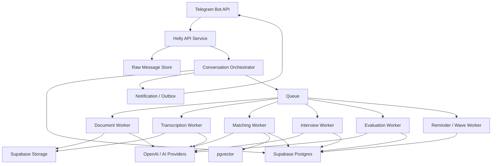

# HELLY v1 Project Architecture

Consolidated Architecture File

Version: 1.0  
Date: 2026-03-07

## 1. Purpose

This document is the single consolidated architecture file for Helly v1.

It is derived from the current documentation set and is intended to be the main reference for implementation.

It combines:

- product constraints from the SRS
- architectural rules from the blueprint
- infrastructure choices
- data and state design assumptions
- implementation structure

If there is a conflict between this file and lower-level implementation details, this file should be used as the architectural baseline and the lower-level documents should then be updated.

## 2. System Summary

Helly is a Telegram-first AI recruitment platform that:

- collects structured candidate profiles
- collects structured vacancy profiles
- performs candidate-vacancy matching
- invites selected candidates to AI interviews
- evaluates completed interviews
- sends only qualified candidate packages to hiring managers

Helly is not a job board and is not an open-ended chatbot. It is a workflow-driven recruiting system with conversational interfaces.

## 3. Core Architectural Position

Helly v1 must be implemented as:

- a stateful backend system
- with deterministic workflow control
- with `LangGraph` orchestrating bounded stage agents
- using AI for bounded stage execution, extraction, ranking, and evaluation
- running on a modular monolith codebase with worker processes

The correct architectural model is not:

- "an AI agent that runs recruiting"

The correct architectural model is:

- a recruiting workflow engine
- with multimodal ingestion
- with explicit state machines
- with LangGraph stage-agent orchestration over workflow stages
- with AI-assisted extraction, ranking, and evaluation
- with backend-validated transitions and side effects

Canonical direction update:

- the active target is no longer a shared state-aware assistance layer around handlers
- the active target is one stage-owning AI agent per major user-facing state
- runtime coordination must use a thin `LangGraph supervisor/router`
- the supervisor/router selects the active stage agent and routes validated output
- the supervisor/router must not behave like a global free-form chat agent above all stages

## 4. Fixed v1 Infrastructure

Helly v1 will use:

- `Supabase Postgres` as the primary database
- `pgvector` in Postgres for embeddings
- `Supabase Storage` for files and media
- `Railway` for deployment
- `Telegram Bot API` for user interaction
- `OpenAI` for LLM-based capabilities

Recommended runtime shape:

- one Railway API service
- one Railway worker service
- one optional Railway scheduler service

## 5. Architecture Principles

## 5.1 State Machine First

Business progression is controlled by backend state machines, not by prompts.

Primary stateful aggregates:

- candidate profile
- vacancy
- match
- interview session
- notification

## 5.2 State-Aware AI Inside Each Step

Helly should not behave like a rigid finite-state form filler.

For every active state, the AI layer should understand:

- whether the user is providing valid input
- whether the user is asking for help or clarification
- whether the user has a constraint that requires an alternative allowed path

The correct pattern is:

- backend provides current state and allowed actions
- AI proposes an in-state response or a bounded action
- backend validates the proposal
- backend either preserves the current state or executes a valid transition

## 5.3 Database as Source of Truth

Operational truth lives in PostgreSQL.

Database stores:

- current states
- structured profile data
- versioned AI-derived artifacts
- audit logs
- job logs
- notification intents

## 5.4 Raw Artifact Preservation

Every inbound Telegram update and every user-submitted artifact must be stored in raw form before downstream transformation.

This includes:

- raw Telegram payloads
- documents
- voice notes
- videos
- transcripts
- AI structured outputs

## 5.5 AI at Controlled Boundaries

AI is used for:

- CV extraction
- JD extraction
- answer parsing
- question planning
- reranking
- evaluation
- conversational recovery text
- state-aware assistance inside active workflow states

AI is not used for:

- state mutation without validation
- permission decisions
- deletion semantics
- invitation concurrency rules

## 5.6 Async Processing for Heavy Work

The Telegram interaction layer must stay responsive.

Heavy tasks must run asynchronously:

- file extraction
- transcription
- embedding generation
- matching
- reranking
- interview evaluation
- reminders and wave handling

## 5.7 Interface-Driven External Integrations

All external systems must be wrapped behind internal interfaces.

Required integration interfaces:

- `TelegramGateway`
- `LLMClient`
- `EmbeddingClient`
- `SpeechTranscriber`
- `DocumentParser`
- `FileStorage`
- `QueueClient`

## 6. High-Level System Diagram



## 7. Main Runtime Components

## 7.1 API Service

Responsibilities:

- Telegram webhook ingress
- raw update persistence
- user resolution
- conversation routing
- synchronous validations
- state transition orchestration
- outbox creation
- job enqueueing

## 7.2 Worker Service

Responsibilities:

- document parsing
- voice/video transcription
- embedding refresh
- matching execution
- interview processing
- evaluation processing

## 7.3 Scheduler Service

Responsibilities:

- invitation expiration checks
- interview timeout checks
- reminder dispatch
- wave expansion logic

This may be a separate Railway service or part of the worker runtime, depending on queue choice.

## 8. Internal Module Architecture

Recommended codebase modules:

- `telegram`
- `identity`
- `conversation`
- `candidate_profile`
- `vacancy`
- `files`
- `llm`
- `parsing`
- `matching`
- `interview`
- `evaluation`
- `notifications`
- `jobs`
- `observability`

## 8.1 `telegram`

Responsibilities:

- webhook controller
- update normalization
- outbound send adapter
- keyboards and Telegram-specific UI helpers

## 8.2 `identity`

Responsibilities:

- Telegram user mapping
- contact storage
- role flags

## 8.3 `conversation`

Responsibilities:

- determine active flow
- route by role and state
- accept or reject user actions based on allowed transitions
- generate next-step prompts
- invoke state-aware AI policy for in-state assistance
- validate AI-proposed actions before transition

## 8.4 `candidate_profile`

Responsibilities:

- candidate onboarding state machine
- summary approval loop
- mandatory field completion
- verification flow
- ready-state validation
- deletion flow

## 8.5 `vacancy`

Responsibilities:

- vacancy onboarding state machine
- JD clarification
- open-state validation
- deletion flow

## 8.6 `files`

Responsibilities:

- file registration
- Supabase Storage access
- content-type handling
- artifact retrieval for parsing/transcription

## 8.7 `llm`

Responsibilities:

- prompt loading
- model routing
- structured output parsing
- AI tracing

## 8.8 `parsing`

Responsibilities:

- document text extraction
- transcript generation
- normalized field parsing

## 8.9 `matching`

Responsibilities:

- hard filters
- vector retrieval
- deterministic scoring
- reranking
- match persistence
- wave candidate selection

## 8.10 `interview`

Responsibilities:

- invitation acceptance/skip flow
- interview session management
- question progression
- follow-up enforcement
- answer storage

## 8.11 `evaluation`

Responsibilities:

- post-interview scoring
- recommendation output
- auto-rejection threshold evaluation
- manager package assembly inputs

## 8.12 `notifications`

Responsibilities:

- durable notification intent creation
- Telegram delivery retries
- reminders
- manager delivery messages
- introduction messages

## 8.13 `jobs`

Responsibilities:

- queue abstraction
- worker entry points
- retry-safe job execution
- dead-letter support

## 8.14 `observability`

Responsibilities:

- structured logs
- metrics
- AI traces
- state transition audit

## 9. Primary Business Flows

## 9.1 Candidate Flow

1. User starts bot.
2. Identity is considered sufficient when the user has a Telegram `username` or a shared `contact`.
3. Role is set to candidate.
5. CV or equivalent experience input is submitted.
6. Parsing/transcription runs asynchronously.
7. Candidate approves or edits summary.
8. Candidate completes mandatory questions.
9. Candidate submits verification video.
10. Profile becomes `READY`.
11. Matching may later lead to interview invitation.

## 9.2 Hiring Manager Flow

1. User starts bot.
2. Identity is considered sufficient when the user has a Telegram `username` or a shared `contact`.
3. Role is set to hiring manager.
4. JD is submitted.
5. Parsing/transcription runs asynchronously.
6. Manager reviews a short vacancy summary and can approve or correct it once.
7. Clarification questions resolve required fields.
8. Vacancy becomes `OPEN`.
9. Matching pipeline is triggered.

## 9.3 Match and Interview Flow

1. Vacancy opens or candidate becomes ready.
2. Hard filters exclude incompatible candidates.
3. Embedding retrieval selects candidate pool.
4. Deterministic scoring ranks candidates.
5. LLM reranking produces final shortlist.
6. Candidates are invited in waves.
7. Accepted invites create interview sessions.
8. Interview answers are collected.
9. Evaluation runs after completion.
10. Qualified candidates are sent to the manager.

## 10. Data Architecture

Primary persisted entities:

- `users`
- `user_consents`
- `files`
- `raw_messages`
- `candidate_profiles`
- `candidate_profile_versions`
- `candidate_verifications`
- `vacancies`
- `vacancy_versions`
- `matching_runs`
- `invite_waves`
- `matches`
- `interview_sessions`
- `interview_questions`
- `interview_answers`
- `evaluation_results`
- `notifications`
- `state_transition_logs`
- `job_execution_logs`
- `outbox_events`

Data architecture rules:

- current business state stays on aggregate root tables
- history stays in version tables and transition logs
- files live in Supabase Storage, metadata in Postgres
- matching uses `pgvector`

## 11. State Architecture

Primary state machines:

- candidate profile lifecycle
- vacancy lifecycle
- match lifecycle
- interview session lifecycle
- notification lifecycle

Rules:

- every state change must be validated
- every state change must be logged
- invalid input does not mutate state
- timeouts are modeled explicitly

## 12. AI Architecture

Primary AI capabilities:

- `candidate_cv_extract`
- `candidate_summary_merge`
- `candidate_mandatory_field_parse`
- `vacancy_jd_extract`
- `vacancy_clarification_parse`
- `vacancy_inconsistency_detect`
- `interview_question_plan`
- `interview_followup_decision`
- `interview_answer_parse`
- `candidate_rerank`
- `candidate_evaluate`

Rules:

- every capability has a versioned prompt asset
- every structured output is schema-validated
- prompt version and model must be stored with important outputs
- AI failures must produce recovery or retry behavior, never silent mutation

## 13. Matching Architecture

Matching must run in stages:

1. normalization
2. hard filtering
3. embedding retrieval
4. deterministic scoring
5. LLM reranking
6. invitation wave selection

Hard filters are fully deterministic.

LLM reranking is only allowed after deterministic shortlist generation.

## 14. File and Media Architecture

Inbound file/media types:

- documents
- pasted text
- voice notes
- video messages
- verification videos

Pipeline:

1. raw artifact registered
2. metadata persisted
3. object stored in Supabase Storage
4. parsing/transcription job executed
5. extracted text/transcript stored
6. AI extraction or downstream flow continues

## 15. Reliability Model

Helly must be reliable under retries and duplicate Telegram updates.

Required controls:

- dedupe on Telegram update ID
- retry-safe async jobs
- outbox-driven notifications where possible
- idempotent invite creation
- logged job attempts

## 16. Security and Privacy Model

Security baseline:

- secrets only through environment configuration
- private file storage by default
- service-role access only on backend
- no direct client-side Supabase trust for business operations

Privacy baseline:

- candidate deletion removes the profile from active flows immediately
- vacancy deletion stops active matching
- verification and interview data are access-restricted

## 17. Recommended Codebase Shape

Recommended initial repository structure:

```text
/
  README.md
  .gitignore
  docs/
  apps/
    api/
    worker/
    scheduler/
  src/
    telegram/
    identity/
    conversation/
    candidate_profile/
    vacancy/
    files/
    llm/
    parsing/
    matching/
    interview/
    evaluation/
    notifications/
    jobs/
    observability/
    shared/
  prompts/
  migrations/
  tests/
  scripts/
```

This may later be adjusted, but implementation should preserve module boundaries even if folder names shift.

## 18. Deployment Architecture

Production deployment target:

- Railway for app runtime
- Supabase for data/storage

Expected deployable units:

- API process
- Worker process
- optional Scheduler process

Required production env groups:

- app config
- Telegram config
- OpenAI config
- Supabase config
- queue config

## 19. Build Order

Recommended implementation order:

1. infrastructure and project scaffold
2. database and migrations
3. Telegram ingress and identity
4. file storage and parsing abstractions
5. candidate onboarding
6. vacancy onboarding
7. matching engine
8. interview engine
9. evaluation and manager review
10. hardening and launch prep

## 20. Authoritative Supporting Documents

This architecture file is backed by:

- [HELLY_V1_SRS.md](./HELLY_V1_SRS.md)
- [HELLY_V1_ARCHITECTURE_BLUEPRINT.md](./HELLY_V1_ARCHITECTURE_BLUEPRINT.md)
- [HELLY_V1_INFRA_DECISIONS.md](./HELLY_V1_INFRA_DECISIONS.md)
- [HELLY_V1_DATA_MODEL_AND_ERD.md](./HELLY_V1_DATA_MODEL_AND_ERD.md)
- [HELLY_V1_STATE_MACHINES.md](./HELLY_V1_STATE_MACHINES.md)
- [HELLY_V1_PROMPT_CATALOG.md](./HELLY_V1_PROMPT_CATALOG.md)
- [HELLY_V1_IMPLEMENTATION_PLAN.md](./HELLY_V1_IMPLEMENTATION_PLAN.md)
- [HELLY_V1_ENGINEERING_BACKLOG.md](./HELLY_V1_ENGINEERING_BACKLOG.md)

## 21. Final Position

Helly v1 should be built as a deterministic recruiting backend with conversational interfaces, not as an unconstrained AI agent.

That means:

- state first
- storage first
- validation first
- AI as a bounded subsystem
- infrastructure kept simple but production-real

This document should be the starting point for all implementation work that follows.
