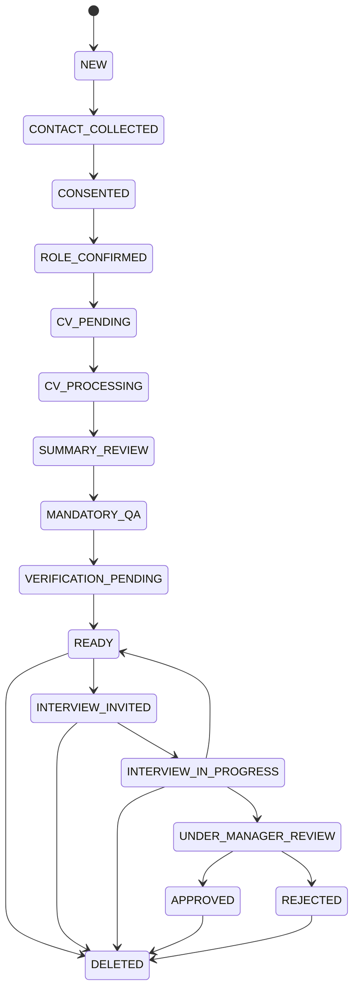
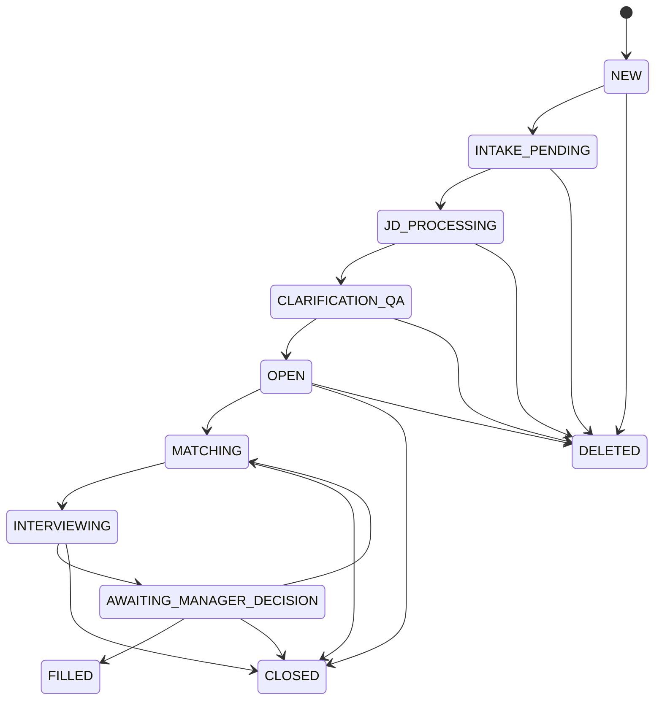
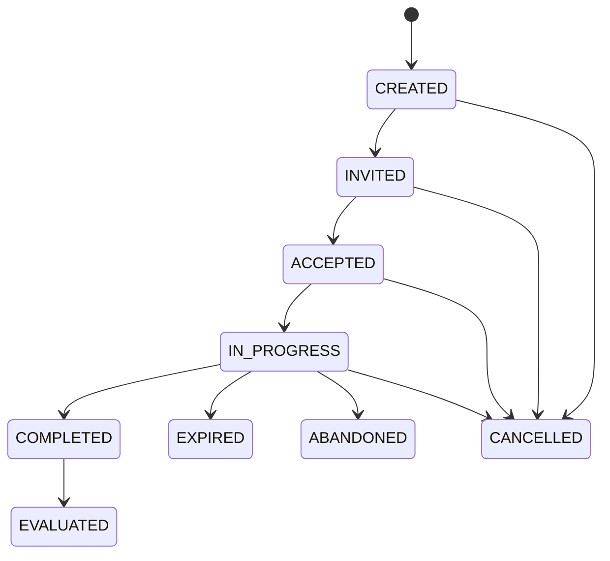

# HELLY v1 State Machines

Detailed Transition Rules and Operational Semantics

Version: 1.0  
Date: 2026-03-07

## 1. Purpose

This document formalizes Helly v1 state machines beyond the brief state lists in the SRS.

It defines:

- states
- transitions
- guards
- side effects
- invalid actions
- timeout behavior

The goal is to prevent business logic from being distributed informally across route handlers, prompts, and workers.

## 2. State Machine Principles

## 2.1 Single Authoritative Current State

Each primary entity stores one current state in its parent table.

## 2.2 Every State Change Must Be Logged

Every successful transition must create a `state_transition_logs` entry.

## 2.3 Guards Are Deterministic

LLMs may help interpret input but may not decide whether a transition is allowed.

## 2.4 Invalid Input Does Not Equal State Change

Unexpected input during a step should usually result in:

- recovery message
- no-op transition
- preserved current state

## 2.5 Timeouts Are Real Events

Expiration, reminder, and wave-advance behavior should be modeled as explicit transitions or explicit transition-triggering events.

## 2.6 Every State Has an In-State Policy Layer

Each state must define not only transition guards, but also allowed conversational assistance behavior.

For every state, the runtime should distinguish between:

- valid transition-triggering input
- help request
- clarification request
- objection or user constraint
- off-topic or unsupported input

The correct response to non-transition input is usually:

- helpful reply
- same state preserved
- no-op business mutation

## 3. Candidate Profile State Machine

## 3.1 Candidate States

- `NEW`
- `CONTACT_COLLECTED`
- `CONSENTED`
- `ROLE_CONFIRMED`
- `CV_PENDING`
- `CV_PROCESSING`
- `SUMMARY_REVIEW`
- `MANDATORY_QA`
- `VERIFICATION_PENDING`
- `READY`
- `INTERVIEW_INVITED`
- `INTERVIEW_IN_PROGRESS`
- `UNDER_MANAGER_REVIEW`
- `APPROVED`
- `REJECTED`
- `DELETED`

## 3.2 Candidate State Diagram

## 3.3 Candidate Transition Matrix

| From | To | Trigger | Guards | Side Effects |
| --- | --- | --- | --- | --- |
| `NEW` | `CONTACT_COLLECTED` | user shares contact | contact payload valid | persist contact, log raw message |
| `CONTACT_COLLECTED` | `CONSENTED` | user grants consent | consent type accepted | persist consent event |
| `CONSENTED` | `ROLE_CONFIRMED` | user selects candidate role | role is `candidate` | set role flags |
| `ROLE_CONFIRMED` | `CV_PENDING` | system enters intake step | none | send CV request |
| `CV_PENDING` | `CV_PROCESSING` | user submits CV/text/voice input | artifact registered | enqueue parse/transcription job |
| `CV_PROCESSING` | `SUMMARY_REVIEW` | processing job succeeds | extraction result valid | create draft profile version, send summary |
| `SUMMARY_REVIEW` | `MANDATORY_QA` | user approves summary | approved version exists | set current version |
| `SUMMARY_REVIEW` | `SUMMARY_REVIEW` | user edits summary | correction loop < max | create new draft version |
| `MANDATORY_QA` | `VERIFICATION_PENDING` | all mandatory fields resolved | salary, location, work format valid | send verification phrase |
| `VERIFICATION_PENDING` | `READY` | verification video submitted | active verification attempt linked to video | mark profile ready |
| `READY` | `INTERVIEW_INVITED` | system sends interview invite | candidate selected for vacancy wave | create notification/update match |
| `INTERVIEW_INVITED` | `INTERVIEW_IN_PROGRESS` | candidate accepts invite | invite not expired | create interview session |
| `INTERVIEW_IN_PROGRESS` | `READY` | interview abandoned or expires before completion | recovery policy returns candidate to pool | update session state |
| `INTERVIEW_IN_PROGRESS` | `UNDER_MANAGER_REVIEW` | interview completed and passes threshold | evaluation above threshold | build manager package |
| `UNDER_MANAGER_REVIEW` | `APPROVED` | manager approves candidate | package exists | trigger introduction |
| `UNDER_MANAGER_REVIEW` | `REJECTED` | manager rejects candidate | manager authorized | notify candidate if policy allows |
| `READY` | `DELETED` | user confirms deletion | none | remove from matching pool |
| `INTERVIEW_INVITED` | `DELETED` | user confirms deletion | deletion policy allows cancellation | cancel pending invitation |
| `INTERVIEW_IN_PROGRESS` | `DELETED` | user confirms deletion | active session cancelable | cancel session, remove from pool |

## 3.4 Candidate State Semantics

### `CV_PENDING`

Meaning:

- candidate flow is active
- no usable experience artifact has been accepted yet

Allowed user actions:

- upload document
- send pasted text
- send voice description

Blocked actions:

- verification submission
- interview actions

### `CV_PROCESSING`

Meaning:

- system has accepted a source artifact
- extraction or transcription is still running

Allowed system behavior:

- acknowledge receipt
- reject duplicate parse jobs by idempotency key

Blocked user actions:

- approval of summary that does not yet exist

### `SUMMARY_REVIEW`

Meaning:

- at least one draft summary exists
- candidate must approve or correct it

Rules:

- maximum correction loops: 1
- no transition forward until an approved version exists

Expected in-state assistance:

- explain that the summary is generated from parsed CV text
- ask what exactly is incorrect
- support one correction round
- show the revised final version before approval

### `MANDATORY_QA`

Meaning:

- summary approved
- required operational fields still unresolved

Rules:

- one follow-up allowed per unresolved field
- all required fields must normalize successfully

### `VERIFICATION_PENDING`

Meaning:

- all fields resolved
- verification video still missing

Rules:

- active phrase must exist
- only current attempt counts toward completion

### `READY`

Meaning:

- candidate is eligible for matching
- onboarding flow is complete

Rules:

- profile changes that materially affect matching may temporarily requeue embedding refresh
- candidate remains matchable until deleted or business policy changes

## 3.5 Candidate Invalid Transition Rules

Examples of invalid transitions:

- `NEW -> ROLE_CONFIRMED` without contact and consent
- `CV_PENDING -> READY` without summary and mandatory questions
- `MANDATORY_QA -> READY` without verification video
- `READY -> APPROVED` without manager review

Invalid transition handling:

- do not mutate state
- log validation failure if operationally useful
- send recovery or explanation message if user-facing

## 4. Vacancy State Machine

## 4.1 Vacancy States

- `NEW`
- `INTAKE_PENDING`
- `JD_PROCESSING`
- `CLARIFICATION_QA`
- `OPEN`
- `MATCHING`
- `INTERVIEWING`
- `AWAITING_MANAGER_DECISION`
- `FILLED`
- `CLOSED`
- `DELETED`

## 4.2 Vacancy State Diagram

## 4.3 Vacancy Transition Matrix

| From | To | Trigger | Guards | Side Effects |
| --- | --- | --- | --- | --- |
| `NEW` | `INTAKE_PENDING` | manager creates vacancy flow | manager identity resolved | send JD request |
| `INTAKE_PENDING` | `JD_PROCESSING` | manager submits JD artifact | artifact registered | enqueue extraction job |
| `JD_PROCESSING` | `CLARIFICATION_QA` | extraction succeeds | draft vacancy version created | send clarification prompts |
| `CLARIFICATION_QA` | `OPEN` | all required vacancy fields resolved | validation passed | set current version, enqueue matching |
| `OPEN` | `MATCHING` | matching run starts | vacancy not deleted/closed | create matching run |
| `MATCHING` | `INTERVIEWING` | at least one invite wave activated | shortlisted candidates exist | create wave, send invites |
| `INTERVIEWING` | `AWAITING_MANAGER_DECISION` | enough candidates complete and pass evaluation | manager package queue not empty | notify manager |
| `AWAITING_MANAGER_DECISION` | `FILLED` | manager approves and vacancy fulfilled | fill policy met | close remaining waves if needed |
| `AWAITING_MANAGER_DECISION` | `MATCHING` | manager rejects all delivered candidates and more pool remains | vacancy still open | schedule next wave or rerun |
| `OPEN` | `CLOSED` | manager closes vacancy | none | stop future waves |
| `MATCHING` | `CLOSED` | manager closes vacancy | none | cancel pending downstream work where safe |
| `INTERVIEWING` | `CLOSED` | manager closes vacancy | none | cancel pending invites/interviews per policy |
| any active | `DELETED` | manager confirms deletion | none | remove from active matching |

## 4.4 Vacancy State Semantics

### `CLARIFICATION_QA`

Meaning:

- extraction produced a usable draft
- mandatory business filters still require explicit manager answers

Required fields:

- budget range
- countries allowed
- work format
- team size
- project description
- primary tech stack

### `OPEN`

Meaning:

- vacancy is eligible to participate in matching
- not every downstream action has started yet

### `MATCHING`

Meaning:

- a matching run is active or recently produced a shortlist

### `INTERVIEWING`

Meaning:

- at least one wave has been launched
- candidates may be invited, accepted, or completing interviews

### `AWAITING_MANAGER_DECISION`

Meaning:

- one or more qualified candidates have completed evaluation
- manager decision is blocking next business outcome

## 4.5 Vacancy Invalid Transition Rules

Examples:

- `INTAKE_PENDING -> OPEN` without parsed/clarified normalized fields
- `OPEN -> FILLED` without manager approval
- `DELETED -> OPEN` unless explicitly supported through restore logic, which v1 does not require

## 5. Match Lifecycle State Machine

## 5.1 Match States

- `FILTERED_OUT`
- `SHORTLISTED`
- `INVITED`
- `ACCEPTED`
- `SKIPPED`
- `EXPIRED`
- `INTERVIEW_COMPLETED`
- `AUTO_REJECTED`
- `MANAGER_REVIEW`
- `APPROVED`
- `REJECTED`
- `CANCELLED`

## 5.2 Match Transition Matrix

| From | To | Trigger | Guards | Side Effects |
| --- | --- | --- | --- | --- |
| none | `FILTERED_OUT` | matching pipeline creates record | hard filters fail | persist reason codes |
| none | `SHORTLISTED` | matching pipeline creates record | shortlisted after rerank | persist scores |
| `SHORTLISTED` | `INVITED` | wave dispatcher sends invite | wave capacity available | create notification |
| `INVITED` | `ACCEPTED` | candidate accepts | invite active and not expired | create interview session |
| `INVITED` | `SKIPPED` | candidate skips | invite active | record response |
| `INVITED` | `EXPIRED` | timeout job runs | invite past expiration | eligible for later replacement wave |
| `ACCEPTED` | `INTERVIEW_COMPLETED` | session completes | session state complete | queue evaluation |
| `INTERVIEW_COMPLETED` | `AUTO_REJECTED` | evaluation below threshold | threshold policy triggered | do not send to manager |
| `INTERVIEW_COMPLETED` | `MANAGER_REVIEW` | evaluation passes threshold | package built | notify manager |
| `MANAGER_REVIEW` | `APPROVED` | manager approves | manager authorized | trigger introduction |
| `MANAGER_REVIEW` | `REJECTED` | manager rejects | manager authorized | close review |
| any active | `CANCELLED` | vacancy deleted or candidate deleted | cancellation policy triggered | cancel pending notifications/interviews |

## 5.3 Match Notes

The match state machine is intentionally more granular than candidate/vacancy states because it is the cross-entity workflow spine for:

- invitation orchestration
- interview creation
- evaluation routing
- manager review

## 6. Interview Session State Machine

## 6.1 Interview Session States

- `CREATED`
- `INVITED`
- `ACCEPTED`
- `IN_PROGRESS`
- `COMPLETED`
- `EXPIRED`
- `ABANDONED`
- `EVALUATED`
- `CANCELLED`

## 6.2 Interview State Diagram

## 6.3 Interview Transition Matrix

| From | To | Trigger | Guards | Side Effects |
| --- | --- | --- | --- | --- |
| none | `CREATED` | session row inserted | match accepted | question plan persisted |
| `CREATED` | `INVITED` | interview start prompt sent | notification success | set session expiry |
| `INVITED` | `ACCEPTED` | candidate sends first positive action or explicit accept | invite active | start session clock if policy requires |
| `ACCEPTED` | `IN_PROGRESS` | first question asked | question plan exists | set current question pointer |
| `IN_PROGRESS` | `IN_PROGRESS` | candidate answers and next question is asked | remaining questions exist | store answer and advance pointer |
| `IN_PROGRESS` | `COMPLETED` | final required answer recorded | all required questions answered | queue evaluation |
| `IN_PROGRESS` | `EXPIRED` | timeout job runs | `expires_at < now()` | close input |
| `IN_PROGRESS` | `ABANDONED` | candidate explicitly stops | stop intent confirmed | close session |
| `COMPLETED` | `EVALUATED` | evaluation job succeeds | evaluation result persisted | update match |
| any active | `CANCELLED` | candidate or vacancy deletion | cancellation policy | stop accepting answers |

## 6.4 Question-Level Rules

Question progression rules:

- only one active primary question at a time
- each primary question may have at most one follow-up
- a follow-up may only be asked after a primary answer exists
- a follow-up may not itself generate another follow-up
- completion requires all primary questions answered

## 6.5 Interview Invalid Transition Rules

Examples:

- `CREATED -> COMPLETED` without asked/answered questions
- `IN_PROGRESS -> EVALUATED` before evaluation result exists
- `EXPIRED -> IN_PROGRESS` unless explicit resume behavior is implemented, which v1 should avoid

## 7. Notification State Machine

## 7.1 Notification States

- `PENDING`
- `SENDING`
- `SENT`
- `FAILED`
- `CANCELLED`

## 7.2 Notification Transition Matrix

| From | To | Trigger | Guards | Side Effects |
| --- | --- | --- | --- | --- |
| none | `PENDING` | notification intent created | template and target exist | queue send |
| `PENDING` | `SENDING` | dispatcher claims intent | not locked by another worker | call Telegram API |
| `SENDING` | `SENT` | provider success | response valid | persist outbound raw message if needed |
| `SENDING` | `FAILED` | provider failure | retry budget may remain | record error |
| `FAILED` | `PENDING` | retry scheduler requeues | retry policy allows | increment failure count |
| `PENDING` | `CANCELLED` | upstream business event invalidates intent | not yet sent | no delivery |

## 8. Timeout and Scheduler Rules

## 8.1 Invitation Expiration

Scheduler checks active invites.

Transition:

- `match.INVITED -> match.EXPIRED`

Effects:

- close invite
- mark candidate unavailable for this wave
- evaluate whether next wave should open

## 8.2 Interview Expiration

Scheduler checks `interview_sessions.expires_at`.

Transition:

- `IN_PROGRESS -> EXPIRED`

Effects:

- reject new answers
- update related match according to policy

## 8.3 Reminder Dispatch

Reminders should not change state directly.

They should:

- inspect current state
- send a reminder notification
- remain idempotent

## 9. Deletion Semantics Across State Machines

Candidate deletion must:

- set `candidate_profiles.state = DELETED`
- cancel pending notifications where applicable
- mark related active matches as `CANCELLED`
- cancel active interview session if one exists

Vacancy deletion must:

- set `vacancies.state = DELETED`
- stop future matching runs
- cancel pending invite waves
- cancel active invites/interviews according to policy

Deletion is a terminal state for v1.

## 10. Implementation Guidance

Recommended implementation pattern:

- transition functions per aggregate root
- transition validation table kept close to domain code
- no direct state assignment from controllers
- transition helper returns:
  - next state
  - required side effects
  - audit metadata

## 11. Testing Guidance

Every state machine requires:

- happy-path transition tests
- invalid transition tests
- idempotent retry tests
- timeout transition tests
- deletion/cancellation tests

## 12. Final Position

The state machine layer is Helly's most important control surface.

If state changes can happen implicitly through prompts, ad hoc route code, or worker shortcuts, the product will become unreliable very quickly. This document should therefore be treated as normative during implementation.
